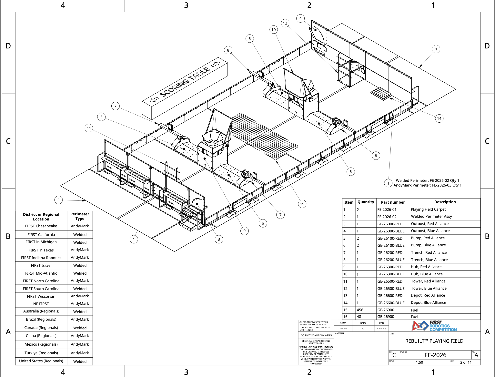
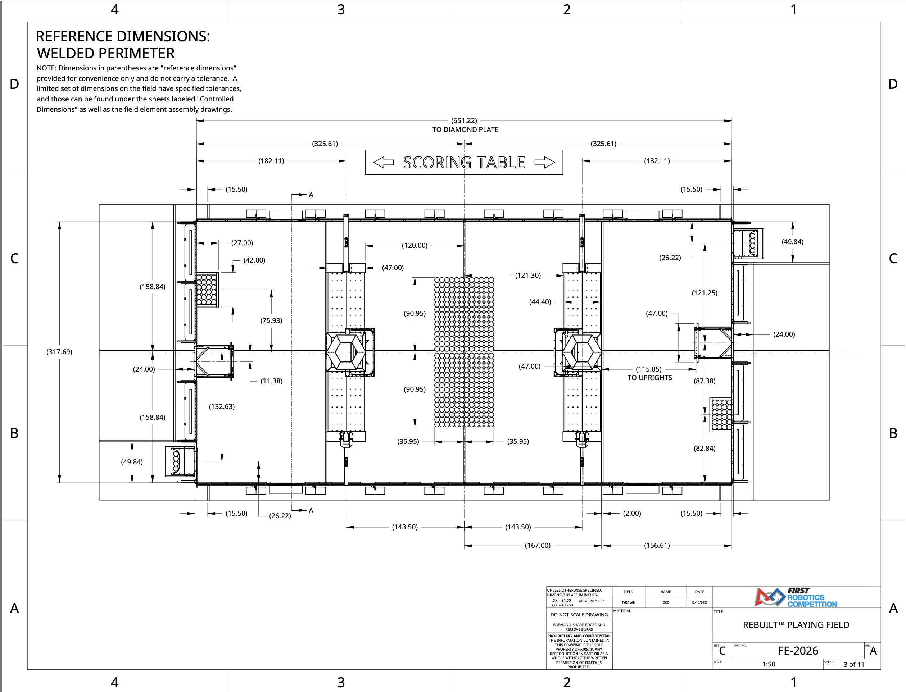
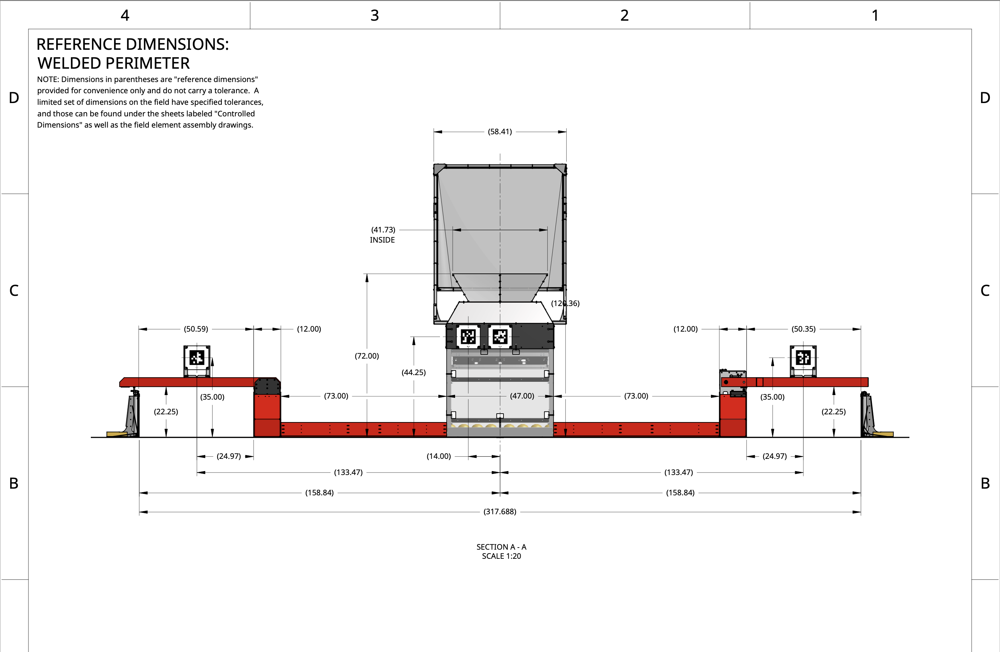
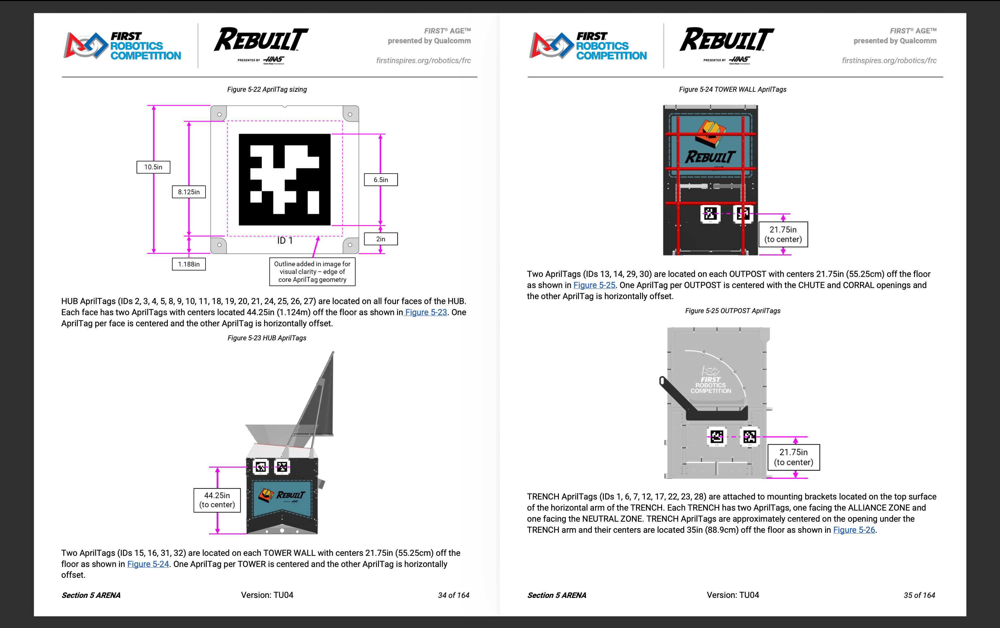
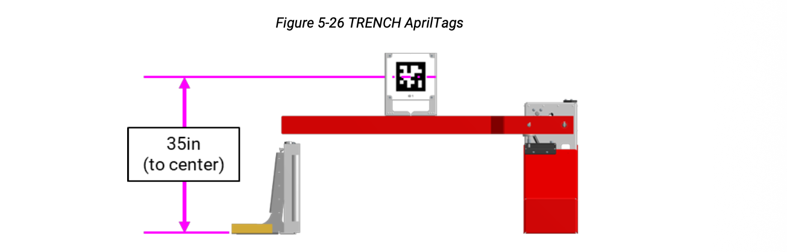

# FRC 2026 REBUILT - Game Field Specifications

**Game:** FIRST AGE - REBUILT (presented by Qualcomm)
**Season:** FRC 2026
**Manual Version:** TU04
**Drawing Number:** FE-2026 (Scale 1:50)

---

## Table of Contents
1. [Field Overview](#field-overview)
2. [Field Components List](#field-components-list)
3. [Playing Field Dimensions](#playing-field-dimensions)
4. [HUB](#hub)
5. [Tower](#tower)
6. [Alliance Wall](#alliance-wall)
7. [Driver Stations](#driver-stations)
8. [Outpost](#outpost)
9. [Trench](#trench)
10. [Bumps](#bumps)
11. [Depot](#depot)
12. [AprilTag Specifications](#apriltag-specifications)
13. [AprilTag Locations](#apriltag-locations)
14. [Perimeter Types by Region](#perimeter-types-by-region)

---

## Field Overview

The REBUILT playing field is a symmetrical arena with identical structures mirrored for Red and Blue alliances. The field features HUBs for scoring FUEL, TRENCHes for traversal, and various game elements for strategic play.

---

## Field Components List

| Item | Qty | Part Number | Description |
|------|-----|-------------|-------------|
| 1 | 2 | FE-2026-01 | Playing Field Carpet |
| 2 | 1 | FE-2026-02 | Welded Perimeter Assy |
| 3 | 1 | GE-26000-RED | Outpost, Red Alliance |
| 4 | 1 | GE-26000-BLUE | Outpost, Blue Alliance |
| 5 | 2 | GE-26100-RED | Bump, Red Alliance |
| 6 | 2 | GE-26100-BLUE | Bump, Blue Alliance |
| 7 | 1 | GE-26200-RED | Trench, Red Alliance |
| 8 | 1 | GE-26200-BLUE | Trench, Blue Alliance |
| 9 | 1 | GE-26300-RED | Hub, Red Alliance |
| 10 | 1 | GE-26300-BLUE | Hub, Blue Alliance |
| 11 | 1 | GE-26500-RED | Tower, Red Alliance |
| 12 | 1 | GE-26500-BLUE | Tower, Blue Alliance |
| 13 | 1 | GE-26600-RED | Depot, Red Alliance |
| 14 | 1 | GE-26600-BLUE | Depot, Blue Alliance |
| 15 | 456 | GE-26900 | Fuel |
| 16 | 48 | GE-26900 | Fuel (additional) |

**Total FUEL on field: 504 pieces**

---

## Playing Field Dimensions

### Overall Field Size
| Measurement | Dimension (inches) | Dimension (metric) |
|-------------|-------------------|-------------------|
| Total width (to diamond plate) | 651.22in | ~16.54m |
| Total length | 317.69in | ~8.07m |
| Alliance wall width (each) | 325.61in | ~8.27m |
| Scoring table width | 182.11in | ~4.63m |

### Field Layout (Top View)
| Zone/Feature | Distance from Alliance Wall | Width |
|--------------|---------------------------|-------|
| Perimeter edge | 15.50in | - |
| First zone boundary | 26.22in | - |
| Bump zone start | 27.00in | - |
| Inner zone | 42.00in | - |
| HUB position | 158.84in (center) | 47.00in |
| Neutral zone center | 167.00in | - |
| Trench zone | 75.93in - 90.95in | 35.95in each |

### Cross-Section Dimensions (Section A-A)
| Feature | Horizontal Position | Notes |
|---------|-------------------|-------|
| Outpost AprilTag | 50.59in / 50.35in from center | Symmetrical |
| Trench extent | 73.00in from HUB centerline | Each side |
| HUB base | 47.00in wide | Centered |
| Total field width | 317.688in | Wall to wall |
| Distance from wall to HUB | 158.84in | To front edge |
| Bump extent | 133.47in from centerline | Each side |

---

## HUB

The HUB is the primary scoring target for delivering FUEL.

### Dimensions
| Measurement | Imperial | Metric |
|-------------|----------|--------|
| Base footprint | 47in x 47in | ~1.19m x 1.19m |
| Top structure width | 58.41in | ~1.48m |
| Hexagonal opening (inside) | 41.73in | ~1.06m |
| Opening height from carpet | 72in | ~1.83m |
| Total structure height | 126.36in | ~3.21m |
| Distance from Alliance Wall | 158.84in | ~4.03m |
| AprilTag height | 44.25in | ~1.12m |

### Positioning
| Measurement | Value |
|-------------|-------|
| Distance to front of HUB | 72.00in from wall |
| Distance to HUB center | 158.84in from wall |
| Clearance zone around HUB | 14.00in |

### Key Features
- Rectangular prism structure with extended opening at top
- Each ALLIANCE has a dedicated HUB centered between two BUMPS
- Net structure at back prevents FUEL from prohibited areas entering
- Four exits at base distribute FUEL into NEUTRAL ZONE

---

## Tower

The TOWER is the central structure of the ALLIANCE WALL containing AprilTags and displays.

### Dimensions
| Measurement | Value |
|-------------|-------|
| Width | 32.25in |
| Height to first level | 27in |
| Height to second level | 45in |
| Height to third level | 63in |
| Total height | 72.1in |

### AprilTag Placement
- Two AprilTags (IDs 15, 16, 31, 32) per TOWER WALL
- AprilTag centers located 21.75in (55.25cm) off the floor
- One AprilTag centered, one horizontally offset

---

## Alliance Wall

The ALLIANCE WALL separates ROBOTS from DRIVE TEAM members in the ALLIANCE AREA.

### Dimensions
| Measurement | Value |
|-------------|-------|
| Total width | 325.61in (~8.27m) |
| Distance to uprights | 115.05in |
| Edge offset | 24.00in |
| Zone boundaries | 121.25in / 121.30in |

### Components
- 3 DRIVER STATIONS
- 1 OUTPOST
- 1 TOWER WALL

---

## Driver Stations

Each DRIVER STATION is 1 of 3 assemblies within an ALLIANCE WALL behind which a DRIVE TEAM operates their ROBOT.

### Dimensions
| Component | Dimension |
|-----------|-----------|
| Diamond plate base height | 36.8in (93.5cm) |
| Transparent plastic sheet | 42in (1.07m) tall |
| Top rail overhang | 2in |
| Top rail depth | 1in |
| Total height from carpet | 78in |

### Operator Console Shelf
| Measurement | Value |
|-------------|-------|
| Width | 69in (1.75m) |
| Depth | 12.25in (31.1cm) |
| Hook-and-loop strip | 54in (1.372m) long x 2in wide |
| Shelf clips | 1in x 2in (2.5cm x 5.1cm) |

### Sponsor Panel
- Height: 6in (15.2cm) tall
- Top of panel: 42.9in (1.09m) from carpet

### Accessibility
A ramp may be available for DRIVE TEAMS with limited mobility. Contact the FTA before matches to arrange accommodations.

---

## Outpost

The OUTPOST contains CHUTE and CORRAL openings for game piece delivery.

### Positioning
| Measurement | Value |
|-------------|-------|
| Distance from field center | 50.59in (Red) / 50.35in (Blue) |
| AprilTag height | 22.25in |
| Horizontal offset | 12.00in from structure edge |

### AprilTag Placement
- Two AprilTags (IDs 13, 14, 29, 30) per OUTPOST
- AprilTag centers located **22.25in** off the floor
- One AprilTag centered with CHUTE and CORRAL openings
- One AprilTag horizontally offset

---

## Trench

The TRENCH provides a traversal path across the field with AprilTags for localization.

### Dimensions
| Measurement | Value |
|-------------|-------|
| Width per trench section | 35.95in |
| Horizontal extent from HUB | 73.00in each side |
| AprilTag height | 35.00in |
| AprilTag horizontal position | 50.59in from centerline |

### Layout
- Two trench sections per alliance side
- Positioned symmetrically around the HUB
- Spacing from center: 90.95in to trench center

### AprilTag Placement
- TRENCH AprilTags (IDs 1, 6, 7, 12, 17, 22, 23, 28) attached to mounting brackets
- Located on top surface of horizontal TRENCH arm
- Each TRENCH has two AprilTags: one facing ALLIANCE ZONE, one facing NEUTRAL ZONE
- Approximately centered on opening under TRENCH arm
- AprilTag centers located **35in (88.9cm)** off the floor

---

## Bumps

Field obstacles that create traversal challenges.

### Positioning
| Measurement | Value |
|-------------|-------|
| Distance from centerline | 133.47in |
| Distance from alliance wall | 158.84in (aligned with HUB) |
| Quantity | 2 per alliance (4 total) |

---

## Depot

Game piece storage and distribution areas.

### Components
- 1 Depot per alliance (Red: GE-26600-RED, Blue: GE-26600-BLUE)
- Located at alliance end of field

---

## AprilTag Specifications

### Physical Dimensions
| Measurement | Value |
|-------------|-------|
| Total tag size (outer) | 10.5in x 10.5in |
| Core AprilTag geometry | 8.125in x 8.125in |
| Inner pattern area | 6.5in x 6.5in |
| Border width | 1.188in |
| Mounting offset | 2in |

### Tag Family
- Standard FRC AprilTag family (36h11)
- Black and white pattern for high contrast
- Includes ID number below pattern

---

## AprilTag Locations

### Summary by Location

| Location | Tag IDs | Height (to center) | Notes |
|----------|---------|-------------------|-------|
| HUB | 2, 3, 4, 5, 8, 9, 10, 11, 18, 19, 20, 21, 24, 25, 26, 27 | 44.25in (1.124m) | All four faces, 2 per face |
| TOWER WALL | 15, 16, 31, 32 | 21.75in (55.25cm) | 2 per tower |
| OUTPOST | 13, 14, 29, 30 | 22.25in | 2 per outpost |
| TRENCH | 1, 6, 7, 12, 17, 22, 23, 28 | 35in (88.9cm) | 2 per trench |

### HUB AprilTags (IDs 2-11, 18-27)
- Located on all four faces of the HUB
- Each face has two AprilTags
- Centers located **44.25in (1.124m)** off the floor
- One per face is centered, one is horizontally offset

### TOWER WALL AprilTags (IDs 15, 16, 31, 32)
- Two AprilTags per TOWER WALL
- Centers located **21.75in (55.25cm)** off the floor
- One centered, one horizontally offset

### OUTPOST AprilTags (IDs 13, 14, 29, 30)
- Two AprilTags per OUTPOST
- Centers located **22.25in** off the floor
- One centered with CHUTE and CORRAL openings
- One horizontally offset

### TRENCH AprilTags (IDs 1, 6, 7, 12, 17, 22, 23, 28)
- Attached to mounting brackets on horizontal TRENCH arm
- Each TRENCH has two AprilTags (one facing each direction)
- Centers located **35in (88.9cm)** off the floor
- Approximately centered on opening under TRENCH arm

---

## Perimeter Types by Region

Different event locations use different perimeter construction:

### AndyMark Perimeter
- FIRST Chesapeake
- FIRST in Texas
- FIRST Indiana Robotics
- FIRST North Carolina
- FIRST Wisconsin
- NE FIRST
- Brazil (Regionals)
- Canada (Regionals)
- China (Regionals)
- Mexico (Regionals)
- Turkiye (Regionals)

### Welded Perimeter
- FIRST California
- FIRST in Michigan
- FIRST Israel
- FIRST Mid-Atlantic
- FIRST South Carolina
- Australia (Regionals)
- United States (Regionals)

---

## Quick Reference - Key Heights

| Structure | Height | Purpose |
|-----------|--------|---------|
| HUB total structure | 126.36in (~3.21m) | Full structure height |
| HUB opening | 72in (1.83m) | FUEL delivery target |
| HUB AprilTags | 44.25in (1.124m) | Vision targeting |
| TRENCH AprilTags | 35in (88.9cm) | Under-trench navigation |
| OUTPOST AprilTags | 22.25in | Alliance wall localization |
| TOWER/WALL AprilTags | 21.75in (55.25cm) | Alliance wall localization |
| Driver Station total | 78in | Operator visibility |

---

## Quick Reference - Key Distances

| Measurement | Distance |
|-------------|----------|
| Total field width | 651.22in (~16.54m) |
| Total field length | 317.69in (~8.07m) |
| Alliance wall width | 325.61in (~8.27m) |
| HUB from Alliance Wall | 158.84in (~4.03m) |
| HUB base footprint | 47in x 47in |
| HUB hexagonal opening | 41.73in (inside) |
| Trench section width | 35.95in |
| Trench from HUB centerline | 73.00in |
| Bump from centerline | 133.47in |

---

## Quick Reference - Vision Targeting

For autonomous navigation and scoring:

| Target | X Position | Y Position (height) | Best Use |
|--------|-----------|---------------------|----------|
| HUB AprilTags | Centered on HUB | 44.25in | Scoring alignment |
| TRENCH AprilTags | 50.59in from center | 35in | Under-trench nav |
| OUTPOST AprilTags | 50.59in from center | 22.25in | Game piece pickup |
| TOWER AprilTags | Field center | 21.75in | Field localization |

---

*Documentation generated from FRC 2026 Game Manual Section 5 ARENA (Version TU04) and Engineering Drawings FE-2026 Sheets 2-3*
