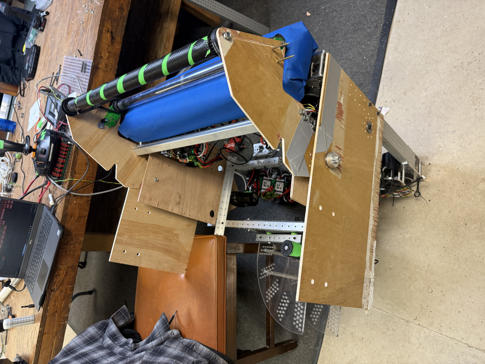
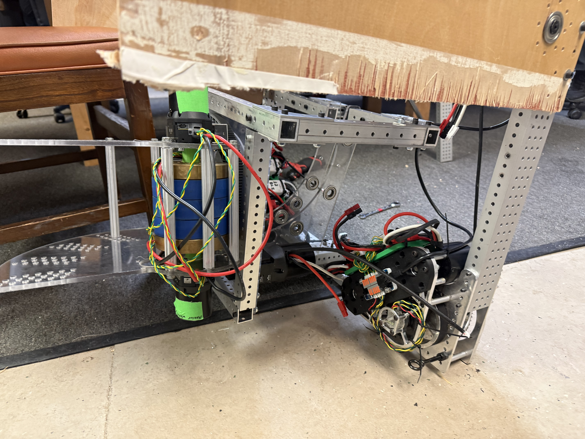
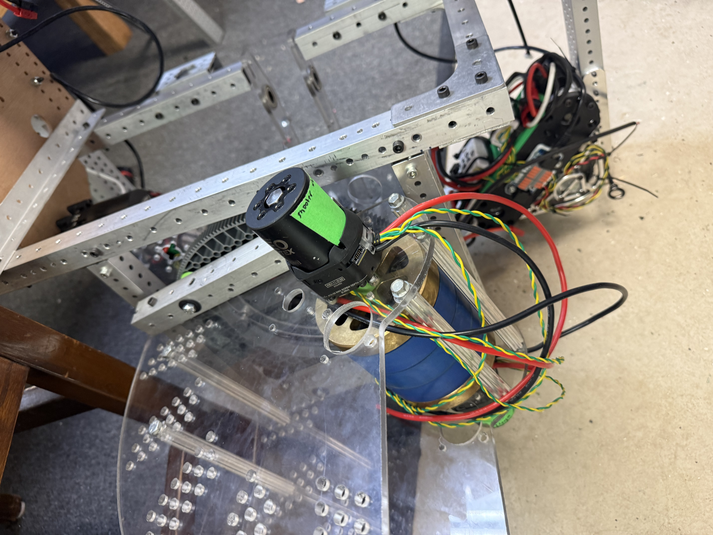
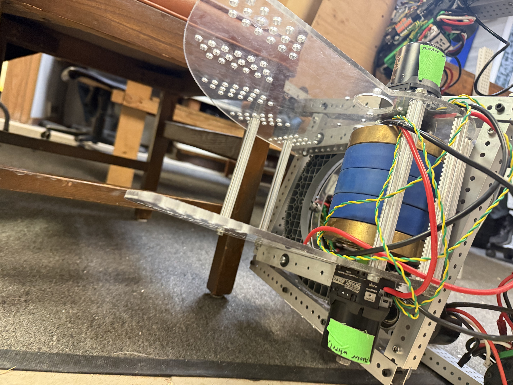

# Robot Subsystems - Design & Implementation Guide

> **Purpose**: This document maps out exactly how we want everything programmed so that all team members understand the code structure and logic. If something goes sideways in any file, we'll know where it is and what kind of logic should be there.

---

## Related Documentation

- [Turret Strategy (Google Doc)](https://docs.google.com/document/d/1WeEUyfwCS4K-zV9DrKdq06biDVZyRlgV0zLkby5eSyU/edit?tab=t.0#heading=h.8uu09bemwrf8) - Original mentor planning document
- [Firmware Updates](01-updating-firmware-to-latest-frc-versions.md) - Pre-season hardware setup
- [AprilTag Vision](02-reading-april-tags.md) - Vision localization with PhotonVision
- [Virtual Field Setup](03-setup-virtual-game-field.md) - Simulation and testing

---

## WPILib 2026 Notes

Key changes affecting our code:

| Change | Impact |
|--------|--------|
| `Subsystem.idle()` | New method for default subsystem behavior |
| `Command.schedule()` deprecated | Use `CommandScheduler.getInstance().schedule(cmd)` instead |
| 2D `MathUtil.applyDeadband()` | Better circular joystick deadband handling |
| Shuffleboard deprecated | Use AdvantageScope, Glass, or Elastic |
| PathWeaver deprecated | Use Choreo or PathPlanner |

---

# Hardware Inventory

## Current Robot State (2026-02-02)

The robot is currently assembled and undergoing maintenance.

> **Note:** All photos below were taken with the robot **on its side** while installing the underbelly. Images are not oriented to normal upright position.

### Robot Overview Photos


*Robot on side - shows intake roller (blue), shooter wheels (green/black), and internal electronics*


*Robot on side - shooter assembly with hood, intake system, and chassis visible*


*Robot on side - battery, electronics panel, and wiring (underbelly being installed)*

### Turret Assembly Photos


*Robot on side - Turret motor (NEO) with through-bore encoder on polycarbonate base*


*Robot on side - Turret mounting assembly, motor position and encoder wiring*

---

## Motor & Sensor Inventory

| Subsystem | Component | Motor Type | Quantity | Encoder |
|-----------|-----------|------------|----------|---------|
| **Chassis** | Swerve Drive | NEO | 8 | Integrated |
| **Intake** | Rotator | NEO | 1 | External Encoder |
| **Intake** | Rollers | NEO | 1 | - |
| **Indexer** | Feed | NEO | 1 | - |
| **Kicker** | Feed to Shooter | NEO Vortex | 1 | - |
| **Shooter** | Turret Rotation | NEO | 1 | Through-Bore Encoder |
| **Shooter** | Flywheel | NEO Vortex | 2 | Integrated |
| **Shooter** | Flywheel | NEO | 1 | Integrated |
| **Shooter** | Hood | NEO | 1 | - |
| **Climber** | Extend/Retract | NEO Vortex | 1 | - |

### Motor Summary

| Motor Type | Count | Notes |
|------------|-------|-------|
| **NEO (REV-21-1650)** | 14 | Brushless, integrated encoder |
| **NEO Vortex (REV-21-1652)** | 4 | Higher power, integrated encoder |
| **Total Motors** | 18 | |

### Encoder Summary

| Encoder Type | Count | Location |
|--------------|-------|----------|
| Through-Bore Encoder | 1 | Shooter Turret |
| External Encoder | 1 | Intake Rotator |
| Integrated (NEO/Vortex) | 18 | All motors |

---

## CAN Bus Device IDs

*TODO: Document actual CAN IDs once finalized*

| Device | CAN ID | Notes |
|--------|--------|-------|
| Swerve FL Drive | TBD | |
| Swerve FL Steer | TBD | |
| Swerve FR Drive | TBD | |
| Swerve FR Steer | TBD | |
| Swerve BL Drive | TBD | |
| Swerve BL Steer | TBD | |
| Swerve BR Drive | TBD | |
| Swerve BR Steer | TBD | |
| Intake Rotator | TBD | |
| Intake Rollers | TBD | |
| Indexer | TBD | |
| Kicker | TBD | |
| Turret | TBD | |
| Shooter Flywheel 1 | TBD | Leader |
| Shooter Flywheel 2 | TBD | Follower |
| Shooter Flywheel 3 | TBD | |
| Shooter Hood | TBD | |
| Climber | TBD | |

---

## Complex Problems to Solve (Priority Order)

1. **Turret** - Auto-aiming system
2. **Shooter** - Hood control, stationary shooting, shooting from anywhere, shooting while moving
3. **Climber** - Automation
4. **Autonomous Paths** - Path planning and execution
5. **Vision Integration** - AprilTag localization (see [02-reading-april-tags.md](02-reading-april-tags.md))

---

# Turret Subsystem

## Implementation Todo List

### Phase 1: Hardware Foundation
- [ ] Create `TurretSubsystem.java` with motor and encoder setup
- [ ] Configure PID controller for position control
- [ ] Add soft limits to prevent over-rotation
- [ ] Implement AdvantageScope logging
- [ ] Test motor responds to manual commands

### Phase 2: Aim Calculation
- [ ] Create `TurretConstants.java` with field positions (hub, pass points)
- [ ] Create `CalculateAimSetpoint.java` with vector math
- [ ] Create `TargetSelecter.java` for target selection logic
- [ ] Unit test aim calculation with known positions
- [ ] Verify math with AdvantageScope visualization

### Phase 3: Default Command
- [ ] Create `AimTurretCommand.java`
- [ ] Wire up pose supplier from drive subsystem
- [ ] Set as default command in RobotContainer
- [ ] Test "always pointing" behavior
- [ ] Add target override for driver control

### Phase 4: Integration
- [ ] Coordinate with shooter for "ready to fire" state
- [ ] Add vision-based target refinement (if applicable)
- [ ] Tune for competition performance

---

## Design Philosophy: "Always Be Pointing"

The turret should **always** have a default command running that keeps it aimed at a target. This means:
- The turret never sits idle
- It continuously tracks based on robot position
- Target selection happens automatically based on field position

## Physical Configuration

### Turret Zero Position
The turret is **zeroed to the back of the robot** (not the front) due to:
- Electrical constraints
- Potential obstruction issues at the front

This means in code, we need to subtract π (PI) from the angle to convert it back to robot-relative "front zero".

---

## Math Concepts for Students

### Understanding Radians

**Why radians over degrees?**
- All WPILib and Java math functions use radians
- Radians represent how far around a circle we've traveled, compared to the radius
- They make the math cleaner for robotics calculations

**Key conversions:**
- 1 radian ≈ 57 degrees
- π (PI) radians = 180° = half circle
- 2π radians = 360° = full circle

**Practice problems:**
- How many degrees is 2.1 radians? → ~120°
- How many degrees is -0.5 radians? → ~-29°

### Mental Math for Robot Directions

Think of the robot from a top-down view:

```
                0 radians (FRONT)
                     ↑
                     |
-π/2 radians ←───────┼───────→ +π/2 radians
(RIGHT)              |            (LEFT)
                     ↓
              ±π radians (BACK)
```

| Direction | Radians | Degrees |
|-----------|---------|---------|
| Front     | 0       | 0°      |
| Left      | π/2     | 90°     |
| Back      | π       | 180°    |
| Right     | -π/2    | -90°    |

### What is `angleModulus`?

The `MathUtil.angleModulus()` function keeps angles within the range of -π to +π radians (-180° to +180°).

**Why do we need this?**
- Without it, angles can grow unbounded (720°, 1080°, etc.)
- It ensures we always take the shortest path to a target angle
- Prevents the turret from spinning multiple full rotations

**Example:**
- Input: 3.5 radians (~200°) → Output: ~-2.78 radians (~-160°)
- Both represent the same direction, but the output is in our standard range

### Vectors in Robotics Context

A **vector** describes both a direction and a magnitude (distance). For turret aiming:
- We create a vector from the robot to the target
- The direction tells us where to point
- The magnitude tells us how far away the target is (useful for shooter speed)

---

## How to Aim: The Math

We need **two pieces of information**:
1. The (x, y) position of the target on the field
2. The pose (x, y, heading) of the robot

### Step-by-Step Calculation

```
Given:
  - Robot position: (x_robot, y_robot)
  - Robot heading: robotHeading
  - Target position: (x_target, y_target)

Step 1: Field Relative - Get vector from robot to target
  dx = x_target - x_robot
  dy = y_target - y_robot

Step 2: Field Relative - Calculate angle to target
  targetFieldAngle = Math.atan2(dy, dx)

Step 3: Robot Relative - Subtract robot's heading
  aimRobotRelative = MathUtil.angleModulus(targetFieldAngle - robotHeading)

Step 4: Turret Relative - Reverse for back-mounted turret
  aimTurretRelative = MathUtil.angleModulus(aimRobotRelative - Math.PI)

Step 5: Apply physical limits
  turretSetpoint = MathUtil.clamp(aimTurretRelative, -limit, +limit)
```

### Practice Problem

**Given:**
- Robot is at position (2, 3)
- Target is at position (8, 7)
- What is the turret setpoint?

**Solution:**
1. dx = 8 - 2 = 6
2. dy = 7 - 3 = 4
3. targetFieldAngle = atan2(4, 6) = atan(4/6) ≈ 0.588 radians (~33.7°)
4. (Continue based on robot heading...)

*Note: To do atan2 on a calculator, use: atan(dy/dx)*

---

## Code Structure

### Folder Structure

```
frc/robot/
├── Constants.java              # All robot constants
├── RobotContainer.java         # Subsystem instantiation, command binding
└── subsystems/
    └── turret/
        ├── TurretSubsystem.java
        ├── TurretConstants.java
        ├── CalculateAimSetpoint.java
        ├── TargetSelecter.java
        └── commands/
            └── AimTurretCommand.java
```

---

## Java Code Stubs

> **Pattern Note:** All subsystems follow the IO interface pattern from our chassis bot for simulation support and AdvantageKit logging.

### Turret Folder Structure
```
subsystems/turret/
├── TurretConstants.java       # Configuration constants
├── TurretIO.java              # Interface + @AutoLog inputs
├── TurretIOReal.java          # SparkMax + Through-Bore hardware
├── TurretIOSim.java           # Simulation implementation
├── TurretSubsystem.java       # Pure logic, receives IO
├── CalculateAimSetpoint.java  # Pure math (unchanged)
├── TargetSelecter.java        # Target selection (unchanged)
└── commands/
    └── AimTurretCommand.java
```

### TurretConstants.java

```java
package frc.robot.subsystems.turret;

import edu.wpi.first.math.geometry.Translation2d;
import edu.wpi.first.math.util.Units;

public final class TurretConstants {
    // Hardware IDs
    // See: photos/subsystems/turret-motor-closeup.jpeg
    public static final int TURRET_MOTOR_ID = 20;      // NEO (SPARK MAX)
    public static final int TURRET_ENCODER_DIO = 0;    // Through-Bore Encoder DIO port

    // Physical Configuration
    public static final double GEAR_RATIO = 100.0;     // Motor rotations per turret rotation
    public static final double POSITION_CONVERSION = (2 * Math.PI) / GEAR_RATIO; // Radians per motor rotation
    public static final double ENCODER_OFFSET_RAD = 0.0; // Through-bore encoder offset (calibrate!)

    // Physical limits (radians from center)
    public static final double MAX_ROTATION_RAD = Units.degreesToRadians(270);
    public static final double MIN_ROTATION_RAD = Units.degreesToRadians(-270);

    // Current limit
    public static final int CURRENT_LIMIT = 40;

    // PID gains (tuned for onboard SPARK MAX PID)
    public static final double kP = 5.0;
    public static final double kI = 0.0;
    public static final double kD = 0.0;

    // Position tolerance
    public static final double POSITION_TOLERANCE_RAD = Units.degreesToRadians(2);

    // Simulation constants
    public static final double MOI = 0.5;              // Moment of inertia kg*m^2
    public static final double ARM_LENGTH = 0.3;       // Meters (for sim visualization)

    // Field positions (meters) - BLUE ALLIANCE
    // TODO: Update these for 2026 REBUILT field
    public static final Translation2d BLUE_HUB = new Translation2d(0.0, 0.0);
    public static final Translation2d BLUE_PASS_POINT_1 = new Translation2d(0.0, 0.0);
    public static final Translation2d BLUE_PASS_POINT_2 = new Translation2d(0.0, 0.0);

    // RED ALLIANCE (mirrored)
    public static final Translation2d RED_HUB = new Translation2d(0.0, 0.0);
    public static final Translation2d RED_PASS_POINT_1 = new Translation2d(0.0, 0.0);
    public static final Translation2d RED_PASS_POINT_2 = new Translation2d(0.0, 0.0);
}
```

### TurretIO.java

```java
package frc.robot.subsystems.turret;

import org.littletonrobotics.junction.AutoLog;

public interface TurretIO {
    @AutoLog
    public static class TurretIOInputs {
        public double positionRad = 0.0;
        public double velocityRadPerSec = 0.0;
        public double appliedVolts = 0.0;
        public double currentAmps = 0.0;
        public double temperatureCelsius = 0.0;
    }

    /** Updates the set of loggable inputs */
    default void updateInputs(TurretIOInputs inputs) {}

    /** Run closed-loop position control */
    default void setPosition(double positionRad) {}

    /** Run open-loop at specified voltage */
    default void setVoltage(double volts) {}

    /** Stop the motor */
    default void stop() {}
}
```

### TurretIOReal.java

```java
package frc.robot.subsystems.turret;

import com.revrobotics.RelativeEncoder;
import com.revrobotics.spark.SparkBase.ControlType;
import com.revrobotics.spark.SparkBase.PersistMode;
import com.revrobotics.spark.SparkBase.ResetMode;
import com.revrobotics.spark.SparkClosedLoopController;
import com.revrobotics.spark.SparkLowLevel.MotorType;
import com.revrobotics.spark.SparkMax;
import com.revrobotics.spark.config.ClosedLoopConfig.FeedbackSensor;
import com.revrobotics.spark.config.SparkBaseConfig.IdleMode;
import com.revrobotics.spark.config.SparkMaxConfig;
import edu.wpi.first.wpilibj.DutyCycleEncoder;

public class TurretIOReal implements TurretIO {
    private final SparkMax motor;
    private final SparkClosedLoopController closedLoopController;
    private final RelativeEncoder motorEncoder;
    private final DutyCycleEncoder throughBoreEncoder;

    public TurretIOReal() {
        motor = new SparkMax(TurretConstants.TURRET_MOTOR_ID, MotorType.kBrushless);

        // Configure SPARK MAX with modern API
        SparkMaxConfig config = new SparkMaxConfig();
        config
            .idleMode(IdleMode.kBrake)
            .smartCurrentLimit(TurretConstants.CURRENT_LIMIT);
        config.encoder
            .positionConversionFactor(TurretConstants.POSITION_CONVERSION)
            .velocityConversionFactor(TurretConstants.POSITION_CONVERSION / 60.0);
        config.closedLoop
            .feedbackSensor(FeedbackSensor.kPrimaryEncoder)
            .pid(TurretConstants.kP, TurretConstants.kI, TurretConstants.kD)
            .positionWrappingEnabled(true)
            .positionWrappingMinInput(-Math.PI)
            .positionWrappingMaxInput(Math.PI);

        motor.configure(config, ResetMode.kResetSafeParameters, PersistMode.kPersistParameters);

        closedLoopController = motor.getClosedLoopController();
        motorEncoder = motor.getEncoder();

        // Through-bore encoder for absolute position
        throughBoreEncoder = new DutyCycleEncoder(TurretConstants.TURRET_ENCODER_DIO);
    }

    @Override
    public void updateInputs(TurretIOInputs inputs) {
        // Use through-bore encoder for absolute position
        inputs.positionRad = (throughBoreEncoder.get() * 2 * Math.PI) - TurretConstants.ENCODER_OFFSET_RAD;
        // Use motor encoder for velocity
        inputs.velocityRadPerSec = motorEncoder.getVelocity();
        inputs.appliedVolts = motor.getAppliedOutput() * motor.getBusVoltage();
        inputs.currentAmps = motor.getOutputCurrent();
        inputs.temperatureCelsius = motor.getMotorTemperature();
    }

    @Override
    public void setPosition(double positionRad) {
        closedLoopController.setReference(positionRad, ControlType.kPosition);
    }

    @Override
    public void setVoltage(double volts) {
        motor.setVoltage(volts);
    }

    @Override
    public void stop() {
        motor.stopMotor();
    }
}
```

### TurretIOSim.java

```java
package frc.robot.subsystems.turret;

import edu.wpi.first.math.MathUtil;
import edu.wpi.first.math.controller.PIDController;
import edu.wpi.first.math.system.plant.DCMotor;
import edu.wpi.first.wpilibj.simulation.SingleJointedArmSim;

public class TurretIOSim implements TurretIO {
    private final SingleJointedArmSim sim;
    private final PIDController pid;

    private double appliedVolts = 0.0;
    private Double positionSetpoint = null;

    public TurretIOSim() {
        sim = new SingleJointedArmSim(
            DCMotor.getNEO(1),
            TurretConstants.GEAR_RATIO,
            TurretConstants.MOI,
            TurretConstants.ARM_LENGTH,
            TurretConstants.MIN_ROTATION_RAD,
            TurretConstants.MAX_ROTATION_RAD,
            true,  // Simulate gravity
            0.0    // Starting angle
        );

        pid = new PIDController(TurretConstants.kP, TurretConstants.kI, TurretConstants.kD);
        pid.enableContinuousInput(-Math.PI, Math.PI);
    }

    @Override
    public void updateInputs(TurretIOInputs inputs) {
        // Run PID if position setpoint is active
        if (positionSetpoint != null) {
            appliedVolts = MathUtil.clamp(
                pid.calculate(sim.getAngleRads(), positionSetpoint),
                -12.0, 12.0
            );
        }

        sim.setInputVoltage(appliedVolts);
        sim.update(0.02);

        inputs.positionRad = sim.getAngleRads();
        inputs.velocityRadPerSec = sim.getVelocityRadPerSec();
        inputs.appliedVolts = appliedVolts;
        inputs.currentAmps = sim.getCurrentDrawAmps();
        inputs.temperatureCelsius = 25.0; // Room temp
    }

    @Override
    public void setPosition(double positionRad) {
        positionSetpoint = positionRad;
    }

    @Override
    public void setVoltage(double volts) {
        positionSetpoint = null;
        appliedVolts = MathUtil.clamp(volts, -12.0, 12.0);
    }

    @Override
    public void stop() {
        positionSetpoint = null;
        appliedVolts = 0.0;
    }
}
```

### TurretSubsystem.java

```java
package frc.robot.subsystems.turret;

import edu.wpi.first.math.MathUtil;
import edu.wpi.first.wpilibj2.command.SubsystemBase;
import org.littletonrobotics.junction.Logger;

public class TurretSubsystem extends SubsystemBase {
    private final TurretIO io;
    private final TurretIOInputsAutoLogged inputs = new TurretIOInputsAutoLogged();

    private double setpointRadians = 0.0;

    public TurretSubsystem(TurretIO io) {
        this.io = io;
    }

    @Override
    public void periodic() {
        // Update and log inputs
        io.updateInputs(inputs);
        Logger.processInputs("Turret", inputs);

        // Log outputs
        Logger.recordOutput("Turret/SetpointRad", setpointRadians);
        Logger.recordOutput("Turret/AtSetpoint", atSetpoint());
    }

    /**
     * Set the turret position setpoint.
     * @param radians Target position in radians (clamped to limits)
     */
    public void setPosition(double radians) {
        this.setpointRadians = MathUtil.clamp(
            radians,
            TurretConstants.MIN_ROTATION_RAD,
            TurretConstants.MAX_ROTATION_RAD
        );
        io.setPosition(setpointRadians);
    }

    /**
     * Get the current turret position.
     * @return Position in radians
     */
    public double getPosition() {
        return inputs.positionRad;
    }

    /**
     * Check if turret is at setpoint.
     * @return true if within tolerance
     */
    public boolean atSetpoint() {
        return Math.abs(inputs.positionRad - setpointRadians) < TurretConstants.POSITION_TOLERANCE_RAD;
    }

    /**
     * Stop the turret motor.
     */
    public void stop() {
        io.stop();
    }
}
```

### CalculateAimSetpoint.java

```java
package frc.robot.subsystems.turret;

import edu.wpi.first.math.MathUtil;
import edu.wpi.first.math.geometry.Pose2d;
import edu.wpi.first.math.geometry.Translation2d;

/**
 * Pure math class - calculates turret aim setpoint.
 * No hardware dependencies, easy to unit test.
 */
public class CalculateAimSetpoint {

    /**
     * Calculate turret setpoint to aim at a target.
     *
     * @param robotPose Current robot pose (x, y, heading)
     * @param targetPosition Target position on field (x, y)
     * @return Turret setpoint in radians (turret-relative)
     */
    public static double calculate(Pose2d robotPose, Translation2d targetPosition) {
        // Step 1: Get vector from robot to target (field relative)
        double dx = targetPosition.getX() - robotPose.getX();
        double dy = targetPosition.getY() - robotPose.getY();

        // Step 2: Calculate angle to target (field relative)
        double targetFieldAngle = Math.atan2(dy, dx);

        // Step 3: Convert to robot relative by subtracting robot heading
        double robotHeading = robotPose.getRotation().getRadians();
        double aimRobotRelative = MathUtil.angleModulus(targetFieldAngle - robotHeading);

        // Step 4: Convert to turret relative (turret zeroed to back)
        double aimTurretRelative = MathUtil.angleModulus(aimRobotRelative - Math.PI);

        // Step 5: Clamp to turret limits
        double turretSetpoint = MathUtil.clamp(
            aimTurretRelative,
            TurretConstants.MIN_ROTATION_RAD,
            TurretConstants.MAX_ROTATION_RAD
        );

        return turretSetpoint;
    }

    /**
     * Calculate distance to target (useful for shooter speed).
     *
     * @param robotPose Current robot pose
     * @param targetPosition Target position
     * @return Distance in meters
     */
    public static double distanceToTarget(Pose2d robotPose, Translation2d targetPosition) {
        return robotPose.getTranslation().getDistance(targetPosition);
    }
}
```

### TargetSelecter.java

```java
package frc.robot.subsystems.turret;

import edu.wpi.first.math.geometry.Pose2d;
import edu.wpi.first.math.geometry.Translation2d;
import edu.wpi.first.wpilibj.DriverStation;
import edu.wpi.first.wpilibj.DriverStation.Alliance;

/**
 * Selects which target to aim at based on robot position.
 */
public class TargetSelecter {

    public enum TargetType {
        HUB,
        PASS_POINT_1,
        PASS_POINT_2
    }

    /**
     * Select the best target based on robot position.
     *
     * @param robotPose Current robot pose
     * @return Translation2d of the selected target
     */
    public static Translation2d selectTarget(Pose2d robotPose) {
        // Default to hub
        return getHubPosition();
    }

    /**
     * Select a specific target type.
     *
     * @param targetType The type of target to get
     * @return Translation2d of the target
     */
    public static Translation2d getTarget(TargetType targetType) {
        boolean isRed = DriverStation.getAlliance()
            .orElse(Alliance.Blue) == Alliance.Red;

        return switch (targetType) {
            case HUB -> isRed ? TurretConstants.RED_HUB : TurretConstants.BLUE_HUB;
            case PASS_POINT_1 -> isRed ? TurretConstants.RED_PASS_POINT_1 : TurretConstants.BLUE_PASS_POINT_1;
            case PASS_POINT_2 -> isRed ? TurretConstants.RED_PASS_POINT_2 : TurretConstants.BLUE_PASS_POINT_2;
        };
    }

    /**
     * Get the hub position for the current alliance.
     */
    public static Translation2d getHubPosition() {
        return getTarget(TargetType.HUB);
    }

    /**
     * Advanced: Select target based on field zones.
     * TODO: Implement zone-based target selection
     */
    public static Translation2d selectTargetByZone(Pose2d robotPose) {
        // Example logic:
        // - If in offensive zone, aim at hub
        // - If in defensive zone, aim at pass point
        // - If near specific field elements, adjust target

        double x = robotPose.getX();
        double y = robotPose.getY();

        // TODO: Define zones based on 2026 REBUILT field layout
        // For now, always return hub
        return getHubPosition();
    }
}
```

### AimTurretCommand.java

```java
package frc.robot.subsystems.turret.commands;

import java.util.function.Supplier;

import edu.wpi.first.math.geometry.Pose2d;
import edu.wpi.first.math.geometry.Translation2d;
import edu.wpi.first.wpilibj2.command.Command;
import frc.robot.subsystems.turret.CalculateAimSetpoint;
import frc.robot.subsystems.turret.TargetSelecter;
import frc.robot.subsystems.turret.TurretSubsystem;

/**
 * Default command that continuously aims the turret at a target.
 * Runs forever - designed to be set as the turret's default command.
 */
public class AimTurretCommand extends Command {
    private final TurretSubsystem turret;
    private final Supplier<Pose2d> poseSupplier;
    private Supplier<Translation2d> targetOverride = null;

    /**
     * Create an aim command with automatic target selection.
     *
     * @param turret The turret subsystem
     * @param poseSupplier Supplier for robot pose (typically drive::getPose)
     */
    public AimTurretCommand(TurretSubsystem turret, Supplier<Pose2d> poseSupplier) {
        this.turret = turret;
        this.poseSupplier = poseSupplier;
        addRequirements(turret);
    }

    /**
     * Create an aim command with a fixed target.
     *
     * @param turret The turret subsystem
     * @param poseSupplier Supplier for robot pose
     * @param targetSupplier Supplier for target position
     */
    public AimTurretCommand(
            TurretSubsystem turret,
            Supplier<Pose2d> poseSupplier,
            Supplier<Translation2d> targetSupplier) {
        this(turret, poseSupplier);
        this.targetOverride = targetSupplier;
    }

    @Override
    public void execute() {
        // 1. Get current robot pose
        Pose2d pose = poseSupplier.get();

        // 2. Get target position (override or auto-select)
        Translation2d target;
        if (targetOverride != null) {
            target = targetOverride.get();
        } else {
            target = TargetSelecter.selectTarget(pose);
        }

        // 3. Calculate turret setpoint
        double setpoint = CalculateAimSetpoint.calculate(pose, target);

        // 4. Command the turret
        turret.setPosition(setpoint);
    }

    @Override
    public void end(boolean interrupted) {
        turret.stop();
    }

    @Override
    public boolean isFinished() {
        // Never finishes - runs as default command
        return false;
    }
}
```

### RobotContainer.java (Turret Wiring)

```java
// In RobotContainer.java

import frc.robot.subsystems.turret.TurretSubsystem;
import frc.robot.subsystems.turret.commands.AimTurretCommand;

public class RobotContainer {
    // Subsystems
    private final DriveSubsystem drive = new DriveSubsystem();
    private final TurretSubsystem turret = new TurretSubsystem();

    public RobotContainer() {
        configureDefaultCommands();
        configureButtonBindings();
    }

    private void configureDefaultCommands() {
        // Turret: ALWAYS be pointing at target
        turret.setDefaultCommand(
            new AimTurretCommand(turret, drive::getPose)
        );
    }

    private void configureButtonBindings() {
        // Example: Override to aim at pass point while button held
        // controller.leftBumper().whileTrue(
        //     new AimTurretCommand(turret, drive::getPose,
        //         () -> TargetSelecter.getTarget(TargetType.PASS_POINT_1))
        // );
    }
}
```

---

# Shooter Subsystem

## Implementation Todo List

### Phase 1: Basic Shooter
- [ ] Create `ShooterSubsystem.java` with flywheel motor(s)
- [ ] Implement velocity control (PID or feedforward)
- [ ] Add "at speed" detection for shooter readiness
- [ ] Test fixed-speed shooting at known distance
- [ ] Log flywheel RPM to AdvantageScope

### Phase 2: Hood Control (if applicable)
- [ ] Create `HoodSubsystem.java` or add to ShooterSubsystem
- [ ] Implement position control for hood angle
- [ ] Define hood presets (close, mid, far)
- [ ] Test hood movement and position accuracy

### Phase 3: Distance-Based Shooting
- [ ] Create `ShooterConstants.java` with lookup tables
- [ ] Implement `InterpolatingTreeMap` for distance → (speed, angle)
- [ ] Integrate with turret distance calculation
- [ ] Tune at multiple distances and populate lookup table

### Phase 4: Shooting While Moving
- [ ] Calculate target lead based on robot velocity
- [ ] Adjust for ball flight time
- [ ] Test and tune velocity compensation
- [ ] Add enable/disable toggle for moving shots

---

## Development Progression

### Phase 1: Stationary Shooting (No Hood)
- Fixed shooter angle
- Variable wheel speed based on distance
- Robot must be stopped to shoot

### Phase 2: Stationary Shooting with Moving Hood
- Adjustable hood angle
- Create lookup table: distance → (wheel speed, hood angle)
- Still requires robot to be stopped

### Phase 3: Shooting from Anywhere
- Use odometry to determine distance
- Interpolate between known good shots
- Account for different field positions

### Phase 4: Shooting While Moving
- Lead the target based on robot velocity
- Adjust for ball flight time
- Most complex - requires velocity compensation

---

## Java Code Stubs

### Shooter Folder Structure
```
subsystems/shooter/
├── ShooterConstants.java      # Configuration constants
├── ShooterIO.java             # Interface + @AutoLog inputs
├── ShooterIOReal.java         # SparkFlex/SparkMax hardware
├── ShooterIOSim.java          # Simulation implementation
└── ShooterSubsystem.java      # Pure logic, receives IO
```

### ShooterConstants.java

```java
package frc.robot.subsystems.shooter;

import edu.wpi.first.math.util.Units;

public final class ShooterConstants {
    // Hardware IDs
    // See: photos/subsystems/robot-side-overview.jpeg (green/black wheels)
    public static final int FLYWHEEL_VORTEX_1_ID = 30;  // NEO Vortex (SPARK Flex) - Leader
    public static final int FLYWHEEL_VORTEX_2_ID = 31;  // NEO Vortex (SPARK Flex) - Follower
    public static final int FLYWHEEL_NEO_ID = 32;       // NEO (SPARK MAX)
    public static final int HOOD_MOTOR_ID = 33;         // NEO (SPARK MAX)

    // Current limits
    public static final int FLYWHEEL_CURRENT_LIMIT = 60;
    public static final int HOOD_CURRENT_LIMIT = 30;

    // Flywheel PID (velocity control on SPARK Flex)
    public static final double FLYWHEEL_kP = 0.0002;
    public static final double FLYWHEEL_kI = 0.0;
    public static final double FLYWHEEL_kD = 0.0;
    public static final double FLYWHEEL_kF = 0.00017; // Feedforward

    // Hood PID (position control)
    public static final double HOOD_kP = 2.0;
    public static final double HOOD_kI = 0.0;
    public static final double HOOD_kD = 0.0;

    // Hood configuration
    public static final double HOOD_GEAR_RATIO = 50.0;
    public static final double HOOD_POSITION_CONVERSION = 360.0 / HOOD_GEAR_RATIO; // Degrees per motor rotation
    public static final double HOOD_MIN_ANGLE_DEG = 20.0;
    public static final double HOOD_MAX_ANGLE_DEG = 60.0;

    // Flywheel tolerances
    public static final double FLYWHEEL_TOLERANCE_RPM = 50.0;
    public static final double HOOD_TOLERANCE_DEG = 1.0;

    // Simulation constants
    public static final double FLYWHEEL_MOI = 0.01; // kg*m^2

    // Shot presets (distance meters → RPM, hood angle)
    // TODO: Populate from testing
    public static final double[][] SHOT_TABLE = {
        // {distance_m, flywheel_rpm, hood_angle_deg}
        {1.0, 2000.0, 25.0},
        {2.0, 2500.0, 35.0},
        {3.0, 3000.0, 45.0},
        {4.0, 3500.0, 55.0},
    };
}
```

### ShooterIO.java

```java
package frc.robot.subsystems.shooter;

import org.littletonrobotics.junction.AutoLog;

public interface ShooterIO {
    @AutoLog
    public static class ShooterIOInputs {
        // Flywheel
        public double flywheelVelocityRPM = 0.0;
        public double flywheelAppliedVolts = 0.0;
        public double flywheelCurrentAmps = 0.0;
        public double flywheelTemperatureCelsius = 0.0;

        // Hood
        public double hoodPositionDeg = 0.0;
        public double hoodVelocityDegPerSec = 0.0;
        public double hoodAppliedVolts = 0.0;
        public double hoodCurrentAmps = 0.0;
    }

    /** Updates the set of loggable inputs */
    default void updateInputs(ShooterIOInputs inputs) {}

    /** Run flywheel at specified velocity (RPM) */
    default void setFlywheelVelocity(double rpm) {}

    /** Set hood to specified angle (degrees) */
    default void setHoodPosition(double degrees) {}

    /** Stop flywheel */
    default void stopFlywheel() {}

    /** Stop hood */
    default void stopHood() {}

    /** Stop everything */
    default void stop() {}
}
```

### ShooterIOReal.java

```java
package frc.robot.subsystems.shooter;

import com.revrobotics.RelativeEncoder;
import com.revrobotics.spark.SparkBase.ControlType;
import com.revrobotics.spark.SparkBase.PersistMode;
import com.revrobotics.spark.SparkBase.ResetMode;
import com.revrobotics.spark.SparkClosedLoopController;
import com.revrobotics.spark.SparkFlex;
import com.revrobotics.spark.SparkLowLevel.MotorType;
import com.revrobotics.spark.SparkMax;
import com.revrobotics.spark.config.ClosedLoopConfig.FeedbackSensor;
import com.revrobotics.spark.config.SparkBaseConfig.IdleMode;
import com.revrobotics.spark.config.SparkFlexConfig;
import com.revrobotics.spark.config.SparkMaxConfig;

public class ShooterIOReal implements ShooterIO {
    // Flywheel motors (2x Vortex + 1x NEO)
    private final SparkFlex flywheelLeader;
    private final SparkFlex flywheelFollower;
    private final SparkMax flywheelNeo;
    private final SparkClosedLoopController flywheelController;
    private final RelativeEncoder flywheelEncoder;

    // Hood motor
    private final SparkMax hoodMotor;
    private final SparkClosedLoopController hoodController;
    private final RelativeEncoder hoodEncoder;

    public ShooterIOReal() {
        // === Flywheel Setup ===
        flywheelLeader = new SparkFlex(ShooterConstants.FLYWHEEL_VORTEX_1_ID, MotorType.kBrushless);
        flywheelFollower = new SparkFlex(ShooterConstants.FLYWHEEL_VORTEX_2_ID, MotorType.kBrushless);
        flywheelNeo = new SparkMax(ShooterConstants.FLYWHEEL_NEO_ID, MotorType.kBrushless);

        // Configure leader Vortex
        SparkFlexConfig leaderConfig = new SparkFlexConfig();
        leaderConfig
            .idleMode(IdleMode.kCoast)
            .smartCurrentLimit(ShooterConstants.FLYWHEEL_CURRENT_LIMIT);
        leaderConfig.closedLoop
            .feedbackSensor(FeedbackSensor.kPrimaryEncoder)
            .pidf(ShooterConstants.FLYWHEEL_kP, ShooterConstants.FLYWHEEL_kI,
                  ShooterConstants.FLYWHEEL_kD, ShooterConstants.FLYWHEEL_kF);

        flywheelLeader.configure(leaderConfig, ResetMode.kResetSafeParameters, PersistMode.kPersistParameters);

        // Configure follower Vortex
        SparkFlexConfig followerConfig = new SparkFlexConfig();
        followerConfig
            .idleMode(IdleMode.kCoast)
            .smartCurrentLimit(ShooterConstants.FLYWHEEL_CURRENT_LIMIT)
            .follow(flywheelLeader, true); // Inverted follower

        flywheelFollower.configure(followerConfig, ResetMode.kResetSafeParameters, PersistMode.kPersistParameters);

        // Configure NEO (follows leader)
        SparkMaxConfig neoConfig = new SparkMaxConfig();
        neoConfig
            .idleMode(IdleMode.kCoast)
            .smartCurrentLimit(ShooterConstants.FLYWHEEL_CURRENT_LIMIT)
            .follow(flywheelLeader, false);

        flywheelNeo.configure(neoConfig, ResetMode.kResetSafeParameters, PersistMode.kPersistParameters);

        flywheelController = flywheelLeader.getClosedLoopController();
        flywheelEncoder = flywheelLeader.getEncoder();

        // === Hood Setup ===
        hoodMotor = new SparkMax(ShooterConstants.HOOD_MOTOR_ID, MotorType.kBrushless);

        SparkMaxConfig hoodConfig = new SparkMaxConfig();
        hoodConfig
            .idleMode(IdleMode.kBrake)
            .smartCurrentLimit(ShooterConstants.HOOD_CURRENT_LIMIT);
        hoodConfig.encoder
            .positionConversionFactor(ShooterConstants.HOOD_POSITION_CONVERSION)
            .velocityConversionFactor(ShooterConstants.HOOD_POSITION_CONVERSION / 60.0);
        hoodConfig.closedLoop
            .feedbackSensor(FeedbackSensor.kPrimaryEncoder)
            .pid(ShooterConstants.HOOD_kP, ShooterConstants.HOOD_kI, ShooterConstants.HOOD_kD);
        hoodConfig.softLimit
            .forwardSoftLimit(ShooterConstants.HOOD_MAX_ANGLE_DEG)
            .forwardSoftLimitEnabled(true)
            .reverseSoftLimit(ShooterConstants.HOOD_MIN_ANGLE_DEG)
            .reverseSoftLimitEnabled(true);

        hoodMotor.configure(hoodConfig, ResetMode.kResetSafeParameters, PersistMode.kPersistParameters);

        hoodController = hoodMotor.getClosedLoopController();
        hoodEncoder = hoodMotor.getEncoder();
    }

    @Override
    public void updateInputs(ShooterIOInputs inputs) {
        // Flywheel
        inputs.flywheelVelocityRPM = flywheelEncoder.getVelocity();
        inputs.flywheelAppliedVolts = flywheelLeader.getAppliedOutput() * flywheelLeader.getBusVoltage();
        inputs.flywheelCurrentAmps = flywheelLeader.getOutputCurrent()
            + flywheelFollower.getOutputCurrent() + flywheelNeo.getOutputCurrent();
        inputs.flywheelTemperatureCelsius = flywheelLeader.getMotorTemperature();

        // Hood
        inputs.hoodPositionDeg = hoodEncoder.getPosition();
        inputs.hoodVelocityDegPerSec = hoodEncoder.getVelocity();
        inputs.hoodAppliedVolts = hoodMotor.getAppliedOutput() * hoodMotor.getBusVoltage();
        inputs.hoodCurrentAmps = hoodMotor.getOutputCurrent();
    }

    @Override
    public void setFlywheelVelocity(double rpm) {
        flywheelController.setReference(rpm, ControlType.kVelocity);
    }

    @Override
    public void setHoodPosition(double degrees) {
        hoodController.setReference(degrees, ControlType.kPosition);
    }

    @Override
    public void stopFlywheel() {
        flywheelLeader.stopMotor();
    }

    @Override
    public void stopHood() {
        hoodMotor.stopMotor();
    }

    @Override
    public void stop() {
        stopFlywheel();
        stopHood();
    }
}
```

### ShooterIOSim.java

```java
package frc.robot.subsystems.shooter;

import edu.wpi.first.math.MathUtil;
import edu.wpi.first.math.controller.PIDController;
import edu.wpi.first.math.system.plant.DCMotor;
import edu.wpi.first.wpilibj.simulation.FlywheelSim;

public class ShooterIOSim implements ShooterIO {
    private final FlywheelSim flywheelSim;
    private final PIDController flywheelPID;
    private final PIDController hoodPID;

    private double flywheelAppliedVolts = 0.0;
    private double hoodAppliedVolts = 0.0;
    private double hoodPositionDeg = ShooterConstants.HOOD_MIN_ANGLE_DEG;
    private Double flywheelSetpointRPM = null;
    private Double hoodSetpointDeg = null;

    public ShooterIOSim() {
        // 3 motors total: 2x Vortex + 1x NEO ≈ 3x NEO equivalent
        flywheelSim = new FlywheelSim(
            DCMotor.getNeoVortex(2).withReduction(1.0),
            1.0,
            ShooterConstants.FLYWHEEL_MOI
        );

        flywheelPID = new PIDController(
            ShooterConstants.FLYWHEEL_kP * 1000, // Scale for sim
            ShooterConstants.FLYWHEEL_kI,
            ShooterConstants.FLYWHEEL_kD
        );

        hoodPID = new PIDController(
            ShooterConstants.HOOD_kP,
            ShooterConstants.HOOD_kI,
            ShooterConstants.HOOD_kD
        );
    }

    @Override
    public void updateInputs(ShooterIOInputs inputs) {
        // Flywheel
        if (flywheelSetpointRPM != null) {
            double currentRPM = flywheelSim.getAngularVelocityRPM();
            flywheelAppliedVolts = MathUtil.clamp(
                flywheelPID.calculate(currentRPM, flywheelSetpointRPM),
                -12.0, 12.0
            );
        }
        flywheelSim.setInputVoltage(flywheelAppliedVolts);
        flywheelSim.update(0.02);

        inputs.flywheelVelocityRPM = flywheelSim.getAngularVelocityRPM();
        inputs.flywheelAppliedVolts = flywheelAppliedVolts;
        inputs.flywheelCurrentAmps = flywheelSim.getCurrentDrawAmps();
        inputs.flywheelTemperatureCelsius = 30.0;

        // Hood (simple position sim)
        if (hoodSetpointDeg != null) {
            hoodAppliedVolts = MathUtil.clamp(
                hoodPID.calculate(hoodPositionDeg, hoodSetpointDeg),
                -12.0, 12.0
            );
        }
        double hoodVelocity = hoodAppliedVolts * 10.0; // deg/sec per volt
        hoodPositionDeg += hoodVelocity * 0.02;
        hoodPositionDeg = MathUtil.clamp(hoodPositionDeg,
            ShooterConstants.HOOD_MIN_ANGLE_DEG, ShooterConstants.HOOD_MAX_ANGLE_DEG);

        inputs.hoodPositionDeg = hoodPositionDeg;
        inputs.hoodVelocityDegPerSec = hoodVelocity;
        inputs.hoodAppliedVolts = hoodAppliedVolts;
        inputs.hoodCurrentAmps = Math.abs(hoodAppliedVolts) * 0.5;
    }

    @Override
    public void setFlywheelVelocity(double rpm) {
        flywheelSetpointRPM = rpm;
    }

    @Override
    public void setHoodPosition(double degrees) {
        hoodSetpointDeg = MathUtil.clamp(degrees,
            ShooterConstants.HOOD_MIN_ANGLE_DEG, ShooterConstants.HOOD_MAX_ANGLE_DEG);
    }

    @Override
    public void stopFlywheel() {
        flywheelSetpointRPM = null;
        flywheelAppliedVolts = 0.0;
    }

    @Override
    public void stopHood() {
        hoodSetpointDeg = null;
        hoodAppliedVolts = 0.0;
    }

    @Override
    public void stop() {
        stopFlywheel();
        stopHood();
    }
}
```

### ShooterSubsystem.java

```java
package frc.robot.subsystems.shooter;

import edu.wpi.first.math.interpolation.InterpolatingDoubleTreeMap;
import edu.wpi.first.wpilibj2.command.SubsystemBase;
import org.littletonrobotics.junction.Logger;

public class ShooterSubsystem extends SubsystemBase {
    private final ShooterIO io;
    private final ShooterIOInputsAutoLogged inputs = new ShooterIOInputsAutoLogged();

    // Interpolation tables for distance-based shooting
    private final InterpolatingDoubleTreeMap rpmTable = new InterpolatingDoubleTreeMap();
    private final InterpolatingDoubleTreeMap hoodTable = new InterpolatingDoubleTreeMap();

    private double targetRPM = 0.0;
    private double targetHoodDeg = ShooterConstants.HOOD_MIN_ANGLE_DEG;

    public ShooterSubsystem(ShooterIO io) {
        this.io = io;

        // Populate interpolation tables from constants
        for (double[] row : ShooterConstants.SHOT_TABLE) {
            rpmTable.put(row[0], row[1]);
            hoodTable.put(row[0], row[2]);
        }
    }

    @Override
    public void periodic() {
        // Update and log inputs
        io.updateInputs(inputs);
        Logger.processInputs("Shooter", inputs);

        // Log targets
        Logger.recordOutput("Shooter/TargetRPM", targetRPM);
        Logger.recordOutput("Shooter/TargetHoodDeg", targetHoodDeg);
        Logger.recordOutput("Shooter/FlywheelAtSpeed", flywheelAtSpeed());
        Logger.recordOutput("Shooter/HoodAtPosition", hoodAtPosition());
        Logger.recordOutput("Shooter/ReadyToShoot", readyToShoot());
    }

    /** Set flywheel to specific RPM */
    public void setFlywheelVelocity(double rpm) {
        this.targetRPM = rpm;
        io.setFlywheelVelocity(rpm);
    }

    /** Set hood to specific angle (degrees) */
    public void setHoodPosition(double degrees) {
        this.targetHoodDeg = degrees;
        io.setHoodPosition(degrees);
    }

    /** Configure shooter for a specific distance */
    public void setForDistance(double distanceMeters) {
        setFlywheelVelocity(rpmTable.get(distanceMeters));
        setHoodPosition(hoodTable.get(distanceMeters));
    }

    /** Get current flywheel velocity */
    public double getFlywheelVelocityRPM() {
        return inputs.flywheelVelocityRPM;
    }

    /** Get current hood position */
    public double getHoodPositionDeg() {
        return inputs.hoodPositionDeg;
    }

    /** Check if flywheel is at target speed */
    public boolean flywheelAtSpeed() {
        return Math.abs(inputs.flywheelVelocityRPM - targetRPM) < ShooterConstants.FLYWHEEL_TOLERANCE_RPM;
    }

    /** Check if hood is at target position */
    public boolean hoodAtPosition() {
        return Math.abs(inputs.hoodPositionDeg - targetHoodDeg) < ShooterConstants.HOOD_TOLERANCE_DEG;
    }

    /** Check if shooter is ready to fire */
    public boolean readyToShoot() {
        return flywheelAtSpeed() && hoodAtPosition() && targetRPM > 0;
    }

    /** Stop the shooter */
    public void stop() {
        targetRPM = 0.0;
        io.stop();
    }
}
```

---

# Intake Subsystem

## Implementation Todo List

### Phase 1: Basic Intake
- [ ] Create `IntakeSubsystem.java` with rotator and roller motors
- [ ] Implement deploy/retract methods for rotator
- [ ] Implement run/stop methods for rollers
- [ ] Add encoder feedback for rotator position
- [ ] Test intake sequence

### Phase 2: Automation
- [ ] Create `IntakeCommand.java` for automatic game piece acquisition
- [ ] Add game piece detection (sensor or current sensing)
- [ ] Integrate with indexer handoff

---

## Hardware

| Component | Motor | Encoder |
|-----------|-------|---------|
| Rotator | 1x NEO | External Encoder |
| Rollers | 1x NEO | - |

## Java Code Stubs

### Intake Folder Structure
```
subsystems/intake/
├── IntakeConstants.java       # Configuration constants
├── IntakeIO.java              # Interface + @AutoLog inputs
├── IntakeIOReal.java          # SparkMax hardware
├── IntakeIOSim.java           # Simulation implementation
└── IntakeSubsystem.java       # Pure logic, receives IO
```

### IntakeConstants.java

```java
package frc.robot.subsystems.intake;

import edu.wpi.first.math.util.Units;

public final class IntakeConstants {
    // Hardware IDs
    public static final int ROTATOR_MOTOR_ID = 50;     // NEO (SPARK MAX)
    public static final int ROLLER_MOTOR_ID = 51;      // NEO (SPARK MAX)
    public static final int ROTATOR_ENCODER_DIO = 1;   // External encoder DIO port

    // Current limits
    public static final int ROTATOR_CURRENT_LIMIT = 30;
    public static final int ROLLER_CURRENT_LIMIT = 40;

    // Rotator configuration
    public static final double ROTATOR_GEAR_RATIO = 25.0;
    public static final double ROTATOR_POSITION_CONVERSION = (2 * Math.PI) / ROTATOR_GEAR_RATIO;
    public static final double ROTATOR_ENCODER_OFFSET_RAD = 0.0; // Calibrate!

    // Rotator PID
    public static final double ROTATOR_kP = 3.0;
    public static final double ROTATOR_kI = 0.0;
    public static final double ROTATOR_kD = 0.0;

    // Positions (radians)
    public static final double DEPLOYED_POSITION_RAD = Units.degreesToRadians(90);
    public static final double RETRACTED_POSITION_RAD = Units.degreesToRadians(0);
    public static final double POSITION_TOLERANCE_RAD = Units.degreesToRadians(5);

    // Roller speeds
    public static final double INTAKE_SPEED = 0.8;
    public static final double EJECT_SPEED = -0.5;

    // Simulation
    public static final double ROTATOR_MOI = 0.1;
    public static final double ROTATOR_ARM_LENGTH = 0.4;
}
```

### IntakeIO.java

```java
package frc.robot.subsystems.intake;

import org.littletonrobotics.junction.AutoLog;

public interface IntakeIO {
    @AutoLog
    public static class IntakeIOInputs {
        // Rotator
        public double rotatorPositionRad = 0.0;
        public double rotatorVelocityRadPerSec = 0.0;
        public double rotatorAppliedVolts = 0.0;
        public double rotatorCurrentAmps = 0.0;

        // Rollers
        public double rollerVelocityRPM = 0.0;
        public double rollerAppliedVolts = 0.0;
        public double rollerCurrentAmps = 0.0;
    }

    default void updateInputs(IntakeIOInputs inputs) {}

    /** Set rotator to position (radians) */
    default void setRotatorPosition(double positionRad) {}

    /** Set roller speed (-1 to 1) */
    default void setRollerSpeed(double percent) {}

    /** Stop rotator */
    default void stopRotator() {}

    /** Stop rollers */
    default void stopRollers() {}

    /** Stop everything */
    default void stop() {}
}
```

### IntakeIOReal.java

```java
package frc.robot.subsystems.intake;

import com.revrobotics.RelativeEncoder;
import com.revrobotics.spark.SparkBase.ControlType;
import com.revrobotics.spark.SparkBase.PersistMode;
import com.revrobotics.spark.SparkBase.ResetMode;
import com.revrobotics.spark.SparkClosedLoopController;
import com.revrobotics.spark.SparkLowLevel.MotorType;
import com.revrobotics.spark.SparkMax;
import com.revrobotics.spark.config.ClosedLoopConfig.FeedbackSensor;
import com.revrobotics.spark.config.SparkBaseConfig.IdleMode;
import com.revrobotics.spark.config.SparkMaxConfig;
import edu.wpi.first.wpilibj.DutyCycleEncoder;

public class IntakeIOReal implements IntakeIO {
    private final SparkMax rotatorMotor;
    private final SparkMax rollerMotor;
    private final SparkClosedLoopController rotatorController;
    private final RelativeEncoder rotatorEncoder;
    private final DutyCycleEncoder absoluteEncoder;

    public IntakeIOReal() {
        // === Rotator Setup ===
        rotatorMotor = new SparkMax(IntakeConstants.ROTATOR_MOTOR_ID, MotorType.kBrushless);

        SparkMaxConfig rotatorConfig = new SparkMaxConfig();
        rotatorConfig
            .idleMode(IdleMode.kBrake)
            .smartCurrentLimit(IntakeConstants.ROTATOR_CURRENT_LIMIT);
        rotatorConfig.encoder
            .positionConversionFactor(IntakeConstants.ROTATOR_POSITION_CONVERSION)
            .velocityConversionFactor(IntakeConstants.ROTATOR_POSITION_CONVERSION / 60.0);
        rotatorConfig.closedLoop
            .feedbackSensor(FeedbackSensor.kPrimaryEncoder)
            .pid(IntakeConstants.ROTATOR_kP, IntakeConstants.ROTATOR_kI, IntakeConstants.ROTATOR_kD);

        rotatorMotor.configure(rotatorConfig, ResetMode.kResetSafeParameters, PersistMode.kPersistParameters);

        rotatorController = rotatorMotor.getClosedLoopController();
        rotatorEncoder = rotatorMotor.getEncoder();

        // Absolute encoder for position reference
        absoluteEncoder = new DutyCycleEncoder(IntakeConstants.ROTATOR_ENCODER_DIO);

        // === Roller Setup ===
        rollerMotor = new SparkMax(IntakeConstants.ROLLER_MOTOR_ID, MotorType.kBrushless);

        SparkMaxConfig rollerConfig = new SparkMaxConfig();
        rollerConfig
            .idleMode(IdleMode.kCoast)
            .smartCurrentLimit(IntakeConstants.ROLLER_CURRENT_LIMIT);

        rollerMotor.configure(rollerConfig, ResetMode.kResetSafeParameters, PersistMode.kPersistParameters);
    }

    @Override
    public void updateInputs(IntakeIOInputs inputs) {
        // Use absolute encoder for position
        inputs.rotatorPositionRad = (absoluteEncoder.get() * 2 * Math.PI) - IntakeConstants.ROTATOR_ENCODER_OFFSET_RAD;
        inputs.rotatorVelocityRadPerSec = rotatorEncoder.getVelocity();
        inputs.rotatorAppliedVolts = rotatorMotor.getAppliedOutput() * rotatorMotor.getBusVoltage();
        inputs.rotatorCurrentAmps = rotatorMotor.getOutputCurrent();

        inputs.rollerVelocityRPM = rollerMotor.getEncoder().getVelocity();
        inputs.rollerAppliedVolts = rollerMotor.getAppliedOutput() * rollerMotor.getBusVoltage();
        inputs.rollerCurrentAmps = rollerMotor.getOutputCurrent();
    }

    @Override
    public void setRotatorPosition(double positionRad) {
        rotatorController.setReference(positionRad, ControlType.kPosition);
    }

    @Override
    public void setRollerSpeed(double percent) {
        rollerMotor.set(percent);
    }

    @Override
    public void stopRotator() {
        rotatorMotor.stopMotor();
    }

    @Override
    public void stopRollers() {
        rollerMotor.stopMotor();
    }

    @Override
    public void stop() {
        stopRotator();
        stopRollers();
    }
}
```

### IntakeIOSim.java

```java
package frc.robot.subsystems.intake;

import edu.wpi.first.math.MathUtil;
import edu.wpi.first.math.controller.PIDController;
import edu.wpi.first.math.system.plant.DCMotor;
import edu.wpi.first.wpilibj.simulation.SingleJointedArmSim;

public class IntakeIOSim implements IntakeIO {
    private final SingleJointedArmSim rotatorSim;
    private final PIDController rotatorPID;

    private double rotatorAppliedVolts = 0.0;
    private double rollerAppliedVolts = 0.0;
    private Double rotatorSetpoint = null;

    public IntakeIOSim() {
        rotatorSim = new SingleJointedArmSim(
            DCMotor.getNEO(1),
            IntakeConstants.ROTATOR_GEAR_RATIO,
            IntakeConstants.ROTATOR_MOI,
            IntakeConstants.ROTATOR_ARM_LENGTH,
            IntakeConstants.RETRACTED_POSITION_RAD,
            IntakeConstants.DEPLOYED_POSITION_RAD + 0.1,
            true,
            IntakeConstants.RETRACTED_POSITION_RAD
        );

        rotatorPID = new PIDController(
            IntakeConstants.ROTATOR_kP,
            IntakeConstants.ROTATOR_kI,
            IntakeConstants.ROTATOR_kD
        );
    }

    @Override
    public void updateInputs(IntakeIOInputs inputs) {
        // Rotator
        if (rotatorSetpoint != null) {
            rotatorAppliedVolts = MathUtil.clamp(
                rotatorPID.calculate(rotatorSim.getAngleRads(), rotatorSetpoint),
                -12.0, 12.0
            );
        }
        rotatorSim.setInputVoltage(rotatorAppliedVolts);
        rotatorSim.update(0.02);

        inputs.rotatorPositionRad = rotatorSim.getAngleRads();
        inputs.rotatorVelocityRadPerSec = rotatorSim.getVelocityRadPerSec();
        inputs.rotatorAppliedVolts = rotatorAppliedVolts;
        inputs.rotatorCurrentAmps = rotatorSim.getCurrentDrawAmps();

        // Roller (simple simulation)
        inputs.rollerVelocityRPM = rollerAppliedVolts / 12.0 * 5000.0; // ~5000 RPM at 12V
        inputs.rollerAppliedVolts = rollerAppliedVolts;
        inputs.rollerCurrentAmps = Math.abs(rollerAppliedVolts) * 2.0;
    }

    @Override
    public void setRotatorPosition(double positionRad) {
        rotatorSetpoint = positionRad;
    }

    @Override
    public void setRollerSpeed(double percent) {
        rollerAppliedVolts = percent * 12.0;
    }

    @Override
    public void stopRotator() {
        rotatorSetpoint = null;
        rotatorAppliedVolts = 0.0;
    }

    @Override
    public void stopRollers() {
        rollerAppliedVolts = 0.0;
    }

    @Override
    public void stop() {
        stopRotator();
        stopRollers();
    }
}
```

### IntakeSubsystem.java

```java
package frc.robot.subsystems.intake;

import edu.wpi.first.wpilibj2.command.SubsystemBase;
import org.littletonrobotics.junction.Logger;

public class IntakeSubsystem extends SubsystemBase {
    private final IntakeIO io;
    private final IntakeIOInputsAutoLogged inputs = new IntakeIOInputsAutoLogged();

    private double targetPositionRad = IntakeConstants.RETRACTED_POSITION_RAD;

    public IntakeSubsystem(IntakeIO io) {
        this.io = io;
    }

    @Override
    public void periodic() {
        io.updateInputs(inputs);
        Logger.processInputs("Intake", inputs);

        Logger.recordOutput("Intake/TargetPositionRad", targetPositionRad);
        Logger.recordOutput("Intake/IsDeployed", isDeployed());
        Logger.recordOutput("Intake/IsRetracted", isRetracted());
    }

    /** Deploy the intake to game piece acquisition position */
    public void deploy() {
        targetPositionRad = IntakeConstants.DEPLOYED_POSITION_RAD;
        io.setRotatorPosition(targetPositionRad);
    }

    /** Retract the intake to stowed position */
    public void retract() {
        targetPositionRad = IntakeConstants.RETRACTED_POSITION_RAD;
        io.setRotatorPosition(targetPositionRad);
    }

    /** Run rollers to intake game piece */
    public void intake() {
        io.setRollerSpeed(IntakeConstants.INTAKE_SPEED);
    }

    /** Run rollers to eject game piece */
    public void eject() {
        io.setRollerSpeed(IntakeConstants.EJECT_SPEED);
    }

    /** Stop rollers */
    public void stopRollers() {
        io.stopRollers();
    }

    /** Check if intake is deployed */
    public boolean isDeployed() {
        return Math.abs(inputs.rotatorPositionRad - IntakeConstants.DEPLOYED_POSITION_RAD)
            < IntakeConstants.POSITION_TOLERANCE_RAD;
    }

    /** Check if intake is retracted */
    public boolean isRetracted() {
        return Math.abs(inputs.rotatorPositionRad - IntakeConstants.RETRACTED_POSITION_RAD)
            < IntakeConstants.POSITION_TOLERANCE_RAD;
    }

    /** Get current position */
    public double getPositionRad() {
        return inputs.rotatorPositionRad;
    }

    /** Stop everything */
    public void stop() {
        io.stop();
    }
}
```

---

# Indexer & Kicker Subsystem

## Implementation Todo List

### Phase 1: Basic Indexer
- [ ] Create `IndexerSubsystem.java` with indexer and kicker motors
- [ ] Implement feed methods
- [ ] Add game piece detection sensors
- [ ] Test indexing sequence

### Phase 2: Shooter Integration
- [ ] Create `FeedCommand.java` for automated feeding to shooter
- [ ] Coordinate with shooter "ready" state
- [ ] Add kicker timing for consistent shots

---

## Hardware

| Component | Motor |
|-----------|-------|
| Indexer | 1x NEO |
| Kicker | 1x NEO Vortex |

## Java Code Stubs

### IndexerConstants.java

```java
package frc.robot.subsystems.indexer;

public final class IndexerConstants {
    // CAN IDs
    public static final int INDEXER_MOTOR_ID = 52;  // NEO (SPARK MAX)
    public static final int KICKER_MOTOR_ID = 53;   // NEO Vortex (SPARK Flex)

    // Sensor DIO
    public static final int GAME_PIECE_SENSOR_DIO = 2;

    // Current limits
    public static final int INDEXER_CURRENT_LIMIT = 30;
    public static final int KICKER_CURRENT_LIMIT = 40;

    // Speeds
    public static final double INDEXER_FEED_SPEED = 0.7;
    public static final double INDEXER_REVERSE_SPEED = -0.4;
    public static final double KICKER_SPEED = 1.0;

    // Timing
    public static final double KICKER_DELAY_SECONDS = 0.1;
}
```

### IndexerIO.java

```java
package frc.robot.subsystems.indexer;

import org.littletonrobotics.junction.AutoLog;

public interface IndexerIO {
    @AutoLog
    public static class IndexerIOInputs {
        // Indexer motor
        public double indexerVelocityRPM = 0.0;
        public double indexerAppliedVolts = 0.0;
        public double indexerCurrentAmps = 0.0;

        // Kicker motor
        public double kickerVelocityRPM = 0.0;
        public double kickerAppliedVolts = 0.0;
        public double kickerCurrentAmps = 0.0;

        // Sensors
        public boolean hasGamePiece = false;
    }

    default void updateInputs(IndexerIOInputs inputs) {}

    /** Set indexer speed (-1 to 1) */
    default void setIndexerSpeed(double percent) {}

    /** Set kicker speed (-1 to 1) */
    default void setKickerSpeed(double percent) {}

    /** Stop indexer */
    default void stopIndexer() {}

    /** Stop kicker */
    default void stopKicker() {}

    /** Stop everything */
    default void stop() {}
}
```

### IndexerIOReal.java

```java
package frc.robot.subsystems.indexer;

import com.revrobotics.spark.SparkBase.PersistMode;
import com.revrobotics.spark.SparkBase.ResetMode;
import com.revrobotics.spark.SparkFlex;
import com.revrobotics.spark.SparkLowLevel.MotorType;
import com.revrobotics.spark.SparkMax;
import com.revrobotics.spark.config.SparkBaseConfig.IdleMode;
import com.revrobotics.spark.config.SparkFlexConfig;
import com.revrobotics.spark.config.SparkMaxConfig;
import edu.wpi.first.wpilibj.DigitalInput;

public class IndexerIOReal implements IndexerIO {
    private final SparkMax indexerMotor;
    private final SparkFlex kickerMotor;
    private final DigitalInput gamePieceSensor;

    public IndexerIOReal() {
        // === Indexer Motor (NEO) ===
        indexerMotor = new SparkMax(IndexerConstants.INDEXER_MOTOR_ID, MotorType.kBrushless);

        SparkMaxConfig indexerConfig = new SparkMaxConfig();
        indexerConfig
            .idleMode(IdleMode.kBrake)
            .smartCurrentLimit(IndexerConstants.INDEXER_CURRENT_LIMIT);

        indexerMotor.configure(indexerConfig, ResetMode.kResetSafeParameters, PersistMode.kPersistParameters);

        // === Kicker Motor (NEO Vortex) ===
        kickerMotor = new SparkFlex(IndexerConstants.KICKER_MOTOR_ID, MotorType.kBrushless);

        SparkFlexConfig kickerConfig = new SparkFlexConfig();
        kickerConfig
            .idleMode(IdleMode.kCoast)
            .smartCurrentLimit(IndexerConstants.KICKER_CURRENT_LIMIT);

        kickerMotor.configure(kickerConfig, ResetMode.kResetSafeParameters, PersistMode.kPersistParameters);

        // === Game Piece Sensor ===
        gamePieceSensor = new DigitalInput(IndexerConstants.GAME_PIECE_SENSOR_DIO);
    }

    @Override
    public void updateInputs(IndexerIOInputs inputs) {
        inputs.indexerVelocityRPM = indexerMotor.getEncoder().getVelocity();
        inputs.indexerAppliedVolts = indexerMotor.getAppliedOutput() * indexerMotor.getBusVoltage();
        inputs.indexerCurrentAmps = indexerMotor.getOutputCurrent();

        inputs.kickerVelocityRPM = kickerMotor.getEncoder().getVelocity();
        inputs.kickerAppliedVolts = kickerMotor.getAppliedOutput() * kickerMotor.getBusVoltage();
        inputs.kickerCurrentAmps = kickerMotor.getOutputCurrent();

        // Sensor returns false when game piece is present (beam broken)
        inputs.hasGamePiece = !gamePieceSensor.get();
    }

    @Override
    public void setIndexerSpeed(double percent) {
        indexerMotor.set(percent);
    }

    @Override
    public void setKickerSpeed(double percent) {
        kickerMotor.set(percent);
    }

    @Override
    public void stopIndexer() {
        indexerMotor.stopMotor();
    }

    @Override
    public void stopKicker() {
        kickerMotor.stopMotor();
    }

    @Override
    public void stop() {
        stopIndexer();
        stopKicker();
    }
}
```

### IndexerIOSim.java

```java
package frc.robot.subsystems.indexer;

public class IndexerIOSim implements IndexerIO {
    private double indexerAppliedVolts = 0.0;
    private double kickerAppliedVolts = 0.0;
    private boolean simulatedGamePiece = false;

    @Override
    public void updateInputs(IndexerIOInputs inputs) {
        // Simple velocity simulation
        inputs.indexerVelocityRPM = indexerAppliedVolts / 12.0 * 5000.0;
        inputs.indexerAppliedVolts = indexerAppliedVolts;
        inputs.indexerCurrentAmps = Math.abs(indexerAppliedVolts) * 2.0;

        inputs.kickerVelocityRPM = kickerAppliedVolts / 12.0 * 6000.0; // Vortex spins faster
        inputs.kickerAppliedVolts = kickerAppliedVolts;
        inputs.kickerCurrentAmps = Math.abs(kickerAppliedVolts) * 2.5;

        inputs.hasGamePiece = simulatedGamePiece;
    }

    @Override
    public void setIndexerSpeed(double percent) {
        indexerAppliedVolts = percent * 12.0;
    }

    @Override
    public void setKickerSpeed(double percent) {
        kickerAppliedVolts = percent * 12.0;
    }

    @Override
    public void stopIndexer() {
        indexerAppliedVolts = 0.0;
    }

    @Override
    public void stopKicker() {
        kickerAppliedVolts = 0.0;
    }

    @Override
    public void stop() {
        stopIndexer();
        stopKicker();
    }

    /** For simulation testing */
    public void setSimulatedGamePiece(boolean present) {
        simulatedGamePiece = present;
    }
}
```

### IndexerSubsystem.java

```java
package frc.robot.subsystems.indexer;

import edu.wpi.first.wpilibj2.command.SubsystemBase;
import org.littletonrobotics.junction.Logger;

public class IndexerSubsystem extends SubsystemBase {
    private final IndexerIO io;
    private final IndexerIOInputsAutoLogged inputs = new IndexerIOInputsAutoLogged();

    public IndexerSubsystem(IndexerIO io) {
        this.io = io;
    }

    @Override
    public void periodic() {
        io.updateInputs(inputs);
        Logger.processInputs("Indexer", inputs);

        Logger.recordOutput("Indexer/HasGamePiece", inputs.hasGamePiece);
    }

    /** Run indexer to feed game piece toward shooter */
    public void feed() {
        io.setIndexerSpeed(IndexerConstants.INDEXER_FEED_SPEED);
    }

    /** Run indexer in reverse */
    public void reverse() {
        io.setIndexerSpeed(IndexerConstants.INDEXER_REVERSE_SPEED);
    }

    /** Run kicker to launch game piece into shooter */
    public void kick() {
        io.setKickerSpeed(IndexerConstants.KICKER_SPEED);
    }

    /** Stop indexer */
    public void stopIndexer() {
        io.stopIndexer();
    }

    /** Stop kicker */
    public void stopKicker() {
        io.stopKicker();
    }

    /** Check if game piece is present in indexer */
    public boolean hasGamePiece() {
        return inputs.hasGamePiece;
    }

    /** Stop everything */
    public void stop() {
        io.stop();
    }
}
```

---

# Climber Subsystem

## Implementation Todo List

### Phase 1: Basic Movement
- [ ] Create `ClimberSubsystem.java` with motor(s)
- [ ] Implement extend/retract methods
- [ ] Add limit switches or position limits
- [ ] Manual control for testing
- [ ] Log position to AdvantageScope

### Phase 2: Position Control
- [ ] Add encoder feedback
- [ ] Implement position presets (stowed, extended, climbing)
- [ ] Test position accuracy and repeatability

### Phase 3: Automated Sequence
- [ ] Create `ClimbSequenceCommand.java`
- [ ] Define state machine for climb stages
- [ ] Add safety interlocks (e.g., can't extend while driving fast)
- [ ] Test full sequence with robot on practice climb bars

### Phase 4: Driver Integration
- [ ] Single-button climb initiation
- [ ] Emergency stop override
- [ ] Status indication on dashboard

---

## Automation Goals
- Reduce driver cognitive load during endgame
- Sequence-based climbing with single button activation
- Safety interlocks to prevent damage

---

## Java Code Stubs

### ClimberConstants.java

```java
package frc.robot.subsystems.climber;

public final class ClimberConstants {
    // CAN ID
    public static final int CLIMBER_MOTOR_ID = 40; // NEO Vortex (SPARK Flex)

    // Current limit (high for climbing load)
    public static final int CURRENT_LIMIT = 80;

    // Gear ratio (motor rotations per output rotation)
    public static final double GEAR_RATIO = 25.0;

    // Drum diameter (meters) - for linear position conversion
    public static final double DRUM_DIAMETER_METERS = 0.03;
    public static final double POSITION_CONVERSION = (Math.PI * DRUM_DIAMETER_METERS) / GEAR_RATIO;

    // Position PID
    public static final double kP = 5.0;
    public static final double kI = 0.0;
    public static final double kD = 0.0;

    // Positions (meters of extension)
    public static final double STOWED_POSITION = 0.0;
    public static final double EXTENDED_POSITION = 0.6;  // Full extension
    public static final double POSITION_TOLERANCE = 0.02;

    // Soft limits (meters)
    public static final double SOFT_LIMIT_FORWARD = 0.65;
    public static final double SOFT_LIMIT_REVERSE = -0.02;

    // Speeds for manual control
    public static final double EXTEND_SPEED = 1.0;
    public static final double RETRACT_SPEED = -1.0;

    // Simulation
    public static final double SIM_CARRIAGE_MASS_KG = 5.0;
}
```

### ClimberIO.java

```java
package frc.robot.subsystems.climber;

import org.littletonrobotics.junction.AutoLog;

public interface ClimberIO {
    @AutoLog
    public static class ClimberIOInputs {
        public double positionMeters = 0.0;
        public double velocityMetersPerSec = 0.0;
        public double appliedVolts = 0.0;
        public double currentAmps = 0.0;
        public double temperatureCelsius = 0.0;
    }

    default void updateInputs(ClimberIOInputs inputs) {}

    /** Set climber to position (meters) */
    default void setPosition(double positionMeters) {}

    /** Run at percent speed (-1 to 1) for manual control */
    default void setSpeed(double percent) {}

    /** Stop the climber */
    default void stop() {}
}
```

### ClimberIOReal.java

```java
package frc.robot.subsystems.climber;

import com.revrobotics.RelativeEncoder;
import com.revrobotics.spark.SparkBase.ControlType;
import com.revrobotics.spark.SparkBase.PersistMode;
import com.revrobotics.spark.SparkBase.ResetMode;
import com.revrobotics.spark.SparkClosedLoopController;
import com.revrobotics.spark.SparkFlex;
import com.revrobotics.spark.SparkLowLevel.MotorType;
import com.revrobotics.spark.config.ClosedLoopConfig.FeedbackSensor;
import com.revrobotics.spark.config.SparkBaseConfig.IdleMode;
import com.revrobotics.spark.config.SparkFlexConfig;

public class ClimberIOReal implements ClimberIO {
    private final SparkFlex motor;
    private final SparkClosedLoopController closedLoopController;
    private final RelativeEncoder encoder;

    public ClimberIOReal() {
        motor = new SparkFlex(ClimberConstants.CLIMBER_MOTOR_ID, MotorType.kBrushless);

        SparkFlexConfig config = new SparkFlexConfig();
        config
            .idleMode(IdleMode.kBrake)
            .smartCurrentLimit(ClimberConstants.CURRENT_LIMIT);

        config.encoder
            .positionConversionFactor(ClimberConstants.POSITION_CONVERSION)
            .velocityConversionFactor(ClimberConstants.POSITION_CONVERSION / 60.0);

        config.closedLoop
            .feedbackSensor(FeedbackSensor.kPrimaryEncoder)
            .pid(ClimberConstants.kP, ClimberConstants.kI, ClimberConstants.kD);

        config.softLimit
            .forwardSoftLimit(ClimberConstants.SOFT_LIMIT_FORWARD)
            .forwardSoftLimitEnabled(true)
            .reverseSoftLimit(ClimberConstants.SOFT_LIMIT_REVERSE)
            .reverseSoftLimitEnabled(true);

        motor.configure(config, ResetMode.kResetSafeParameters, PersistMode.kPersistParameters);

        closedLoopController = motor.getClosedLoopController();
        encoder = motor.getEncoder();

        // Zero encoder on startup (assumes robot starts with climber stowed)
        encoder.setPosition(0.0);
    }

    @Override
    public void updateInputs(ClimberIOInputs inputs) {
        inputs.positionMeters = encoder.getPosition();
        inputs.velocityMetersPerSec = encoder.getVelocity();
        inputs.appliedVolts = motor.getAppliedOutput() * motor.getBusVoltage();
        inputs.currentAmps = motor.getOutputCurrent();
        inputs.temperatureCelsius = motor.getMotorTemperature();
    }

    @Override
    public void setPosition(double positionMeters) {
        closedLoopController.setReference(positionMeters, ControlType.kPosition);
    }

    @Override
    public void setSpeed(double percent) {
        motor.set(percent);
    }

    @Override
    public void stop() {
        motor.stopMotor();
    }
}
```

### ClimberIOSim.java

```java
package frc.robot.subsystems.climber;

import edu.wpi.first.math.MathUtil;
import edu.wpi.first.math.controller.PIDController;
import edu.wpi.first.math.system.plant.DCMotor;
import edu.wpi.first.wpilibj.simulation.ElevatorSim;

public class ClimberIOSim implements ClimberIO {
    private final ElevatorSim sim;
    private final PIDController pid;

    private double appliedVolts = 0.0;
    private Double positionSetpoint = null;

    public ClimberIOSim() {
        sim = new ElevatorSim(
            DCMotor.getNeoVortex(1),
            ClimberConstants.GEAR_RATIO,
            ClimberConstants.SIM_CARRIAGE_MASS_KG,
            ClimberConstants.DRUM_DIAMETER_METERS / 2.0,
            ClimberConstants.SOFT_LIMIT_REVERSE,
            ClimberConstants.SOFT_LIMIT_FORWARD,
            true,
            ClimberConstants.STOWED_POSITION
        );

        pid = new PIDController(
            ClimberConstants.kP,
            ClimberConstants.kI,
            ClimberConstants.kD
        );
    }

    @Override
    public void updateInputs(ClimberIOInputs inputs) {
        if (positionSetpoint != null) {
            appliedVolts = MathUtil.clamp(
                pid.calculate(sim.getPositionMeters(), positionSetpoint),
                -12.0, 12.0
            );
        }

        sim.setInputVoltage(appliedVolts);
        sim.update(0.02);

        inputs.positionMeters = sim.getPositionMeters();
        inputs.velocityMetersPerSec = sim.getVelocityMetersPerSecond();
        inputs.appliedVolts = appliedVolts;
        inputs.currentAmps = sim.getCurrentDrawAmps();
        inputs.temperatureCelsius = 25.0; // Simulated room temp
    }

    @Override
    public void setPosition(double positionMeters) {
        positionSetpoint = positionMeters;
    }

    @Override
    public void setSpeed(double percent) {
        positionSetpoint = null;
        appliedVolts = percent * 12.0;
    }

    @Override
    public void stop() {
        positionSetpoint = null;
        appliedVolts = 0.0;
    }
}
```

### ClimberSubsystem.java

```java
package frc.robot.subsystems.climber;

import edu.wpi.first.wpilibj2.command.SubsystemBase;
import org.littletonrobotics.junction.Logger;

public class ClimberSubsystem extends SubsystemBase {
    public enum ClimberState {
        STOWED,
        EXTENDING,
        EXTENDED,
        RETRACTING,
        CLIMBED
    }

    private final ClimberIO io;
    private final ClimberIOInputsAutoLogged inputs = new ClimberIOInputsAutoLogged();

    private ClimberState state = ClimberState.STOWED;
    private double targetPositionMeters = ClimberConstants.STOWED_POSITION;

    public ClimberSubsystem(ClimberIO io) {
        this.io = io;
    }

    @Override
    public void periodic() {
        io.updateInputs(inputs);
        Logger.processInputs("Climber", inputs);

        // Update state based on position
        updateState();

        Logger.recordOutput("Climber/State", state.toString());
        Logger.recordOutput("Climber/TargetPositionMeters", targetPositionMeters);
        Logger.recordOutput("Climber/IsExtended", isExtended());
        Logger.recordOutput("Climber/IsStowed", isStowed());
    }

    private void updateState() {
        if (isStowed() && state != ClimberState.EXTENDING) {
            state = ClimberState.STOWED;
        } else if (isExtended() && state != ClimberState.RETRACTING) {
            state = ClimberState.EXTENDED;
        } else if (isStowed() && state == ClimberState.RETRACTING) {
            state = ClimberState.CLIMBED;
        }
    }

    /** Extend climber to full height */
    public void extend() {
        state = ClimberState.EXTENDING;
        targetPositionMeters = ClimberConstants.EXTENDED_POSITION;
        io.setPosition(targetPositionMeters);
    }

    /** Retract climber (for climbing) */
    public void retract() {
        state = ClimberState.RETRACTING;
        targetPositionMeters = ClimberConstants.STOWED_POSITION;
        io.setPosition(targetPositionMeters);
    }

    /** Manual control - extend */
    public void manualExtend() {
        state = ClimberState.EXTENDING;
        io.setSpeed(ClimberConstants.EXTEND_SPEED);
    }

    /** Manual control - retract */
    public void manualRetract() {
        state = ClimberState.RETRACTING;
        io.setSpeed(ClimberConstants.RETRACT_SPEED);
    }

    /** Stop the climber */
    public void stop() {
        io.stop();
    }

    /** Check if climber is at extended position */
    public boolean isExtended() {
        return Math.abs(inputs.positionMeters - ClimberConstants.EXTENDED_POSITION)
            < ClimberConstants.POSITION_TOLERANCE;
    }

    /** Check if climber is at stowed position */
    public boolean isStowed() {
        return Math.abs(inputs.positionMeters - ClimberConstants.STOWED_POSITION)
            < ClimberConstants.POSITION_TOLERANCE;
    }

    /** Get current position in meters */
    public double getPositionMeters() {
        return inputs.positionMeters;
    }

    /** Get current state */
    public ClimberState getState() {
        return state;
    }

    /** Get current draw (for detecting load/stall) */
    public double getCurrentAmps() {
        return inputs.currentAmps;
    }
}
```

### ClimbSequenceCommand.java

```java
package frc.robot.subsystems.climber.commands;

import edu.wpi.first.wpilibj2.command.Command;
import frc.robot.subsystems.climber.ClimberSubsystem;
import org.littletonrobotics.junction.Logger;

/**
 * Automated climbing sequence.
 * Single button press initiates full climb.
 */
public class ClimbSequenceCommand extends Command {
    private final ClimberSubsystem climber;
    private ClimbStage currentStage = ClimbStage.IDLE;

    private enum ClimbStage {
        IDLE,
        EXTENDING,
        WAIT_FOR_HOOK,
        RETRACTING,
        COMPLETE
    }

    public ClimbSequenceCommand(ClimberSubsystem climber) {
        this.climber = climber;
        addRequirements(climber);
    }

    @Override
    public void initialize() {
        currentStage = ClimbStage.EXTENDING;
        Logger.recordOutput("Climber/ClimbStage", currentStage.toString());
    }

    @Override
    public void execute() {
        switch (currentStage) {
            case EXTENDING:
                climber.extend();
                if (climber.isExtended()) {
                    currentStage = ClimbStage.WAIT_FOR_HOOK;
                    climber.stop();
                }
                break;

            case WAIT_FOR_HOOK:
                // Wait for driver confirmation or sensor
                // TODO: Add hook detection or button press
                // For now, auto-advance after brief pause
                currentStage = ClimbStage.RETRACTING;
                break;

            case RETRACTING:
                climber.retract();
                if (climber.isStowed()) {
                    currentStage = ClimbStage.COMPLETE;
                    climber.stop();
                }
                break;

            case COMPLETE:
            case IDLE:
                climber.stop();
                break;
        }

        Logger.recordOutput("Climber/ClimbStage", currentStage.toString());
    }

    @Override
    public void end(boolean interrupted) {
        climber.stop();
        Logger.recordOutput("Climber/ClimbStage", "ENDED");
    }

    @Override
    public boolean isFinished() {
        return currentStage == ClimbStage.COMPLETE;
    }
}
```

---

# Autonomous Paths

## Implementation Todo List

### Phase 1: Infrastructure
- [ ] Install PathPlanner or Choreo
- [ ] Configure swerve/drive kinematics
- [ ] Create test paths in path editor
- [ ] Verify path following with simple path

### Phase 2: Game Paths
- [ ] Design auto routines for 2026 REBUILT game
- [ ] Create named commands for game actions
- [ ] Build path groups for different starting positions
- [ ] Test paths in simulation

### Phase 3: Integration
- [ ] Add auto selector to dashboard
- [ ] Integrate with vision for initial pose
- [ ] Test on practice field
- [ ] Tune PID and feedforward values

---

## Planning Approach

**Recommended Tools (2026):**
- **Choreo** - Trajectory optimization with physics constraints
- **PathPlanner** - User-friendly path creation with auto builder

*Note: PathWeaver is deprecated as of 2026*

---

## Java Code Stubs

### AutoBuilder Setup (PathPlanner)

```java
// In DriveSubsystem constructor or separate AutoConfig class

import com.pathplanner.lib.auto.AutoBuilder;
import com.pathplanner.lib.util.HolonomicPathFollowerConfig;
import com.pathplanner.lib.util.PIDConstants;
import com.pathplanner.lib.util.ReplanningConfig;

public void configureAutoBuilder() {
    AutoBuilder.configureHolonomic(
        this::getPose,              // Pose supplier
        this::resetPose,            // Pose reset consumer
        this::getChassisSpeeds,     // ChassisSpeeds supplier
        this::driveRobotRelative,   // ChassisSpeeds consumer
        new HolonomicPathFollowerConfig(
            new PIDConstants(5.0, 0.0, 0.0),  // Translation PID
            new PIDConstants(5.0, 0.0, 0.0),  // Rotation PID
            4.5,                               // Max module speed m/s
            0.4,                               // Drive base radius m
            new ReplanningConfig()
        ),
        () -> {
            // Flip path for red alliance
            var alliance = DriverStation.getAlliance();
            return alliance.isPresent() && alliance.get() == Alliance.Red;
        },
        this                         // Subsystem requirement
    );
}
```

### Auto Selector

```java
// In RobotContainer

import com.pathplanner.lib.auto.AutoBuilder;
import edu.wpi.first.wpilibj.smartdashboard.SendableChooser;
import edu.wpi.first.wpilibj.smartdashboard.SmartDashboard;
import edu.wpi.first.wpilibj2.command.Command;

private final SendableChooser<Command> autoChooser;

public RobotContainer() {
    // Build auto chooser from PathPlanner paths
    autoChooser = AutoBuilder.buildAutoChooser();
    SmartDashboard.putData("Auto Chooser", autoChooser);
}

public Command getAutonomousCommand() {
    return autoChooser.getSelected();
}
```

---

# Vision Integration

See [02-reading-april-tags.md](02-reading-april-tags.md) for full vision setup.

## Implementation Todo List

- [ ] PhotonVision co-processor flashed (see [01-updating-firmware-to-latest-frc-versions.md](01-updating-firmware-to-latest-frc-versions.md))
- [ ] Camera(s) mounted and calibrated
- [ ] PhotonVision configured with correct camera transforms
- [ ] Pose estimator consuming vision measurements
- [ ] AdvantageScope visualization working
- [ ] Vision data integrated with turret aiming

---

# Learning Resources

For students who want to understand these concepts better, try asking AI tools questions like:
- "What is a radian and why do we use radians over degrees in FRC robotics?"
- "What is the angular modulus method and why use -π to +π instead of 0° to 360°?"
- "How do vectors work for calculating aim angles in robotics?"
- "Explain atan2 and why it's better than atan for robotics"

The mentor will also cover these topics in person during team meetings.

---

## Change Log

| Date | Author | Changes |
|------|--------|---------|
| 2026-02-02 | BetaWolves | Initial documentation - Turret strategy and math |
| 2026-02-02 | BetaWolves | Added todo lists, Java code stubs, WPILib 2026 notes |
| 2026-02-02 | BetaWolves | Added hardware inventory (18 motors), robot photos, Intake/Indexer/Kicker stubs |
