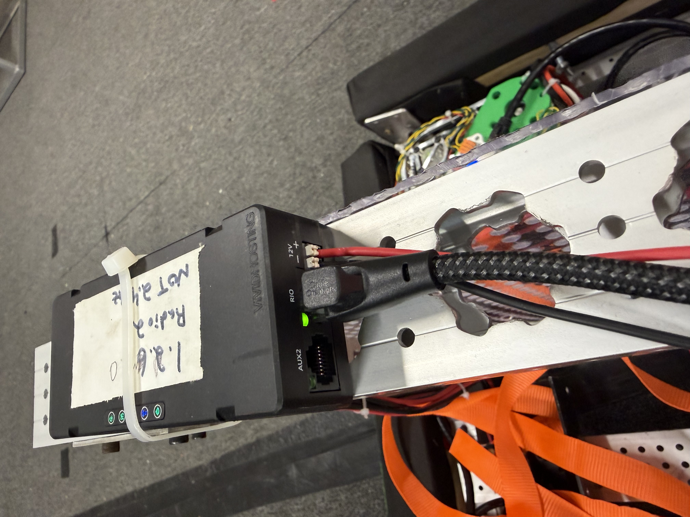
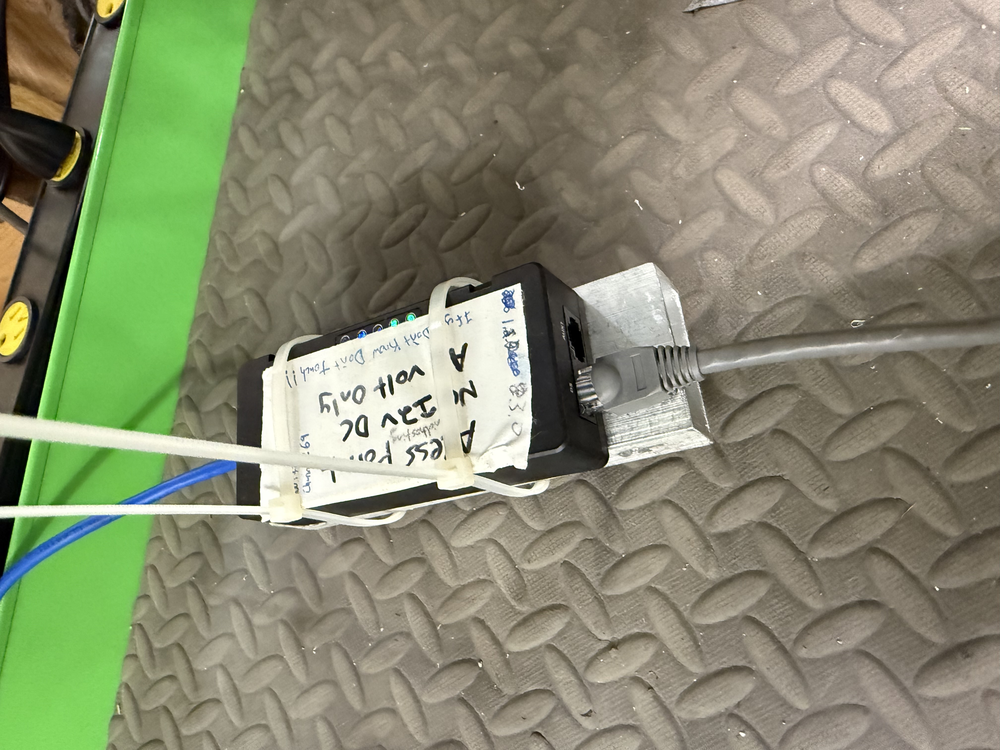
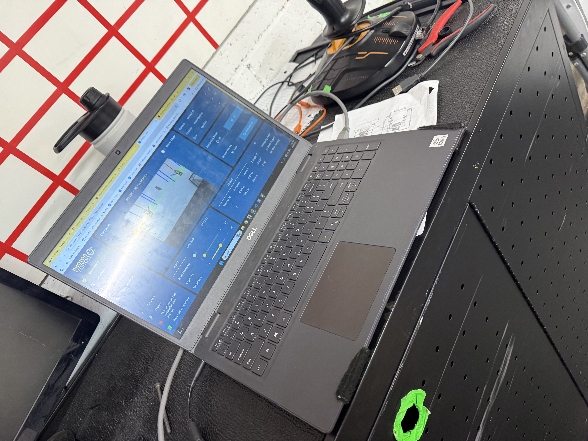
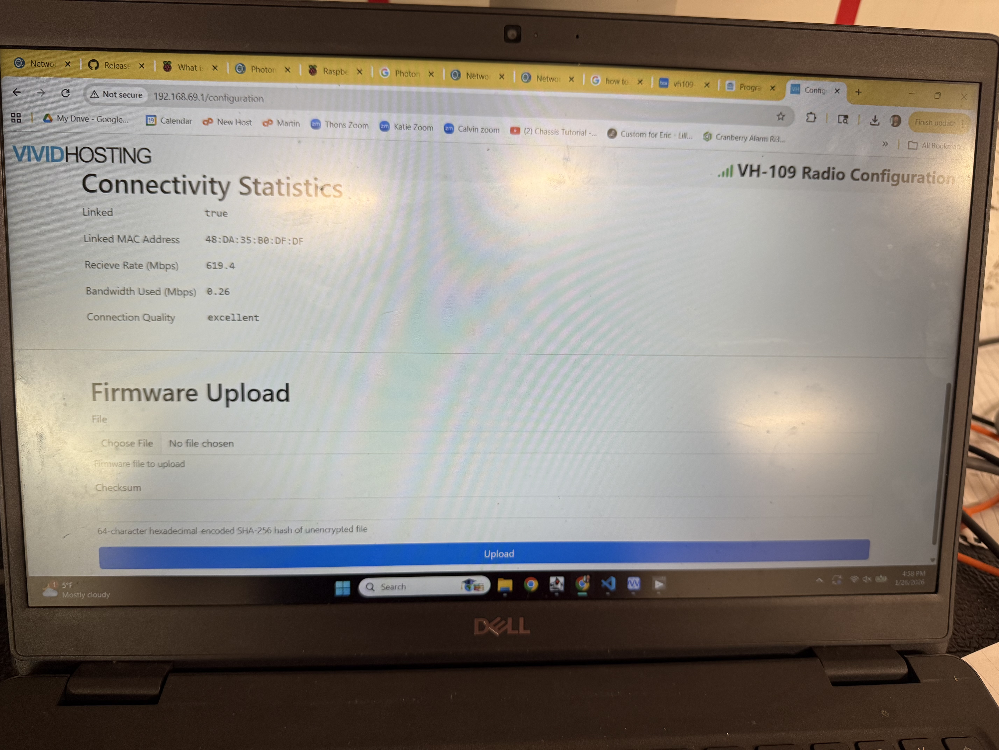
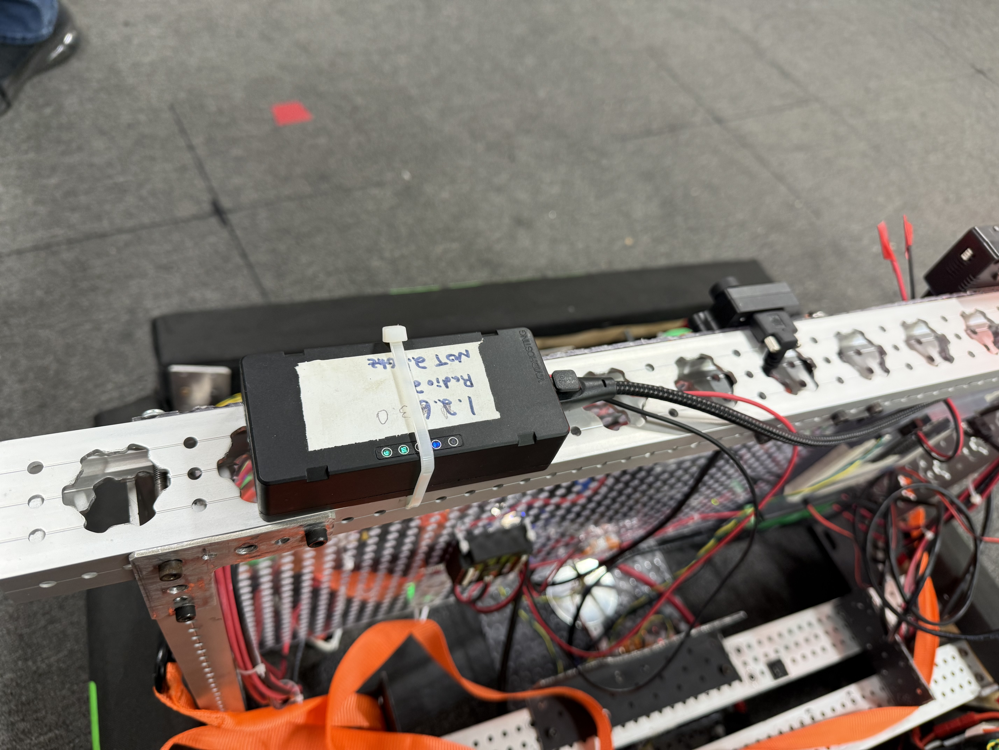
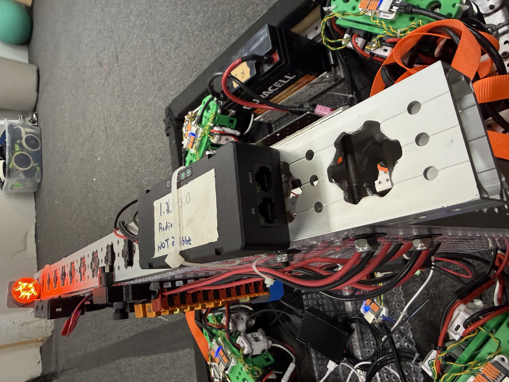
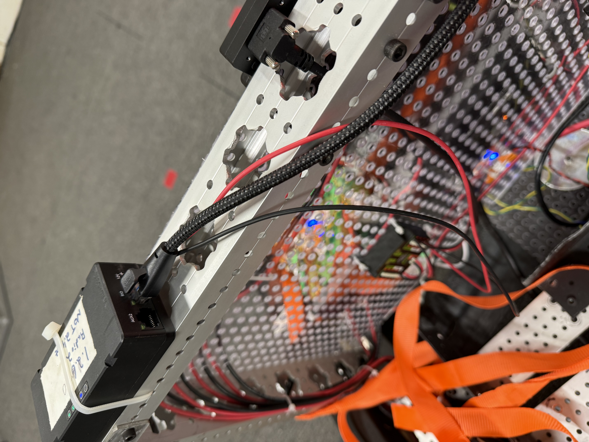
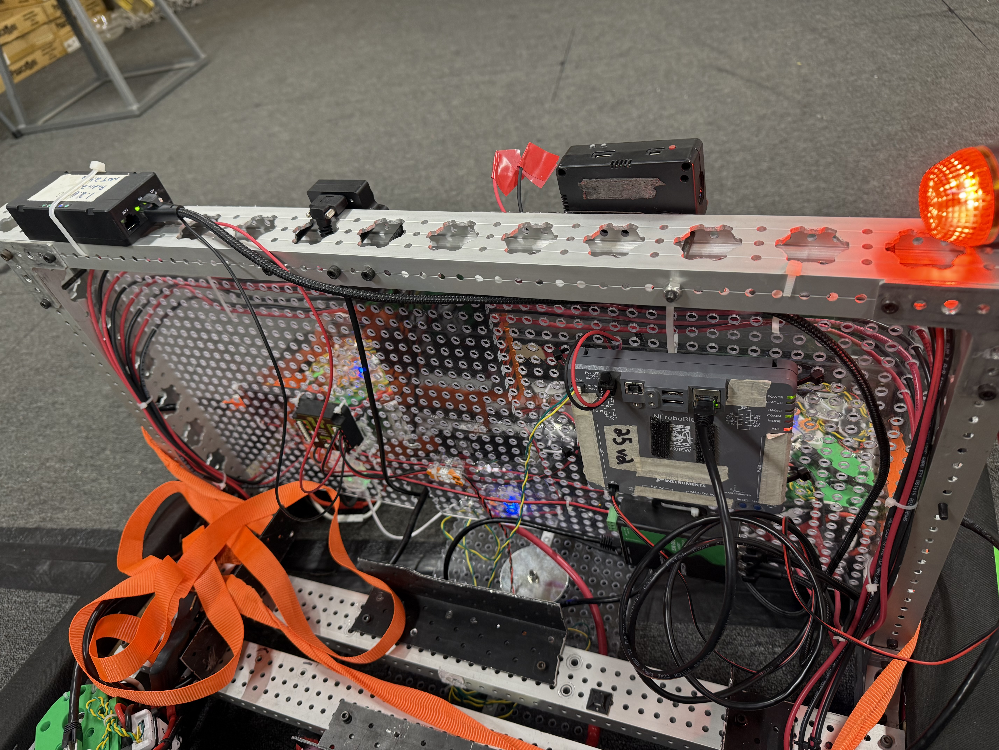

# Updating Robot System Software & Component Firmware to latest FRC 2026 Season Updates

This document covers the pre-season checklist for updating all firmware and software for our FRC robot. Complete these steps before the kickoff event to ensure everything is competition-ready.

**Important:** Complete these steps in order - each step depends on the previous one.

---

## Step 1: FRC Game Tools Installation

The FRC Game Tools package from National Instruments contains essential software for robot operation and configuration.

**Official Documentation:** https://docs.wpilib.org/en/stable/docs/zero-to-robot/step-2/frc-game-tools.html

### What's Included

The FRC Game Tools package installs:
- **FRC Driver Station** - Required to control your robot
- **FRC roboRIO Imaging Tool** - Required to image/configure the roboRIO
- **roboRIO Images** - The operating system files for the roboRIO
- **LabVIEW Update** - Runtime components (you don't need full LabVIEW installed)

### Prerequisites

- Windows 10 or Windows 11 (required - no macOS/Linux support)
- Administrator access on the computer
- Internet connection for download
- National Instruments account (free to create)

### Installation Steps

#### 1. Uninstall Previous Versions

If you have previous years' FRC Game Tools installed:
1. Open **Add or Remove Programs** in Windows Settings
2. Search for "NI Software"
3. Uninstall all NI/National Instruments FRC-related entries
4. Restart your computer

> **Note:** If you use LabVIEW for robot programming, check the WPILib docs for specific uninstall guidance to avoid removing needed components.

#### 2. Download FRC Game Tools

1. Go to the NI FRC Game Tools download page (search "NI FRC Game Tools 2026")
2. Log in or create a free National Instruments account
3. Choose your installer:
   - **Online Installer** - Smaller download, installs components as needed
   - **Offline Installer (ISO)** - Full package for multiple machines or no internet

#### 3. Run the Installer

**For Online Installer:**
- Double-click the downloaded `.exe` file
- Follow the prompts

**For Offline Installer (ISO):**
1. Right-click the ISO file → Select **Mount**
2. Open the mounted drive
3. Run `install.exe`

#### 4. Complete Installation

1. Accept the license agreements
2. **Windows Fast Startup**: Leave at default settings (recommended to prevent USB driver issues)
3. If prompted about .NET Framework 4.6.2, allow it to install first
4. Review the summary and click Install
5. **Reboot when prompted** - This is required for drivers to work correctly

#### 5. Verify Installation

After reboot, confirm these shortcuts exist on your desktop:
- [ ] FRC Driver Station
- [ ] roboRIO Imaging Tool

---

## Step 2: roboRIO Imaging

The roboRIO must be imaged with the current season's firmware before use. This process installs the operating system and sets your team number.

**Official Documentation:** https://docs.wpilib.org/en/stable/docs/zero-to-robot/step-3/imaging-your-roborio.html

### Prerequisites

- [ ] FRC Game Tools installed (Step 1 complete)
- [ ] roboRIO properly wired to Power Distribution Panel
- [ ] All 4 power connector screws tightened securely
- [ ] USB A-to-B cable (standard printer cable)
- [ ] Your team number

### Connection Setup

1. **Power the roboRIO** via the Power Distribution Panel (or dedicated 12V supply)
2. **Connect USB cable** from your PC to the roboRIO's **USB Device port** (USB-B connector)
3. Wait for Windows to install the USB driver automatically
4. The Power LED on the roboRIO should be solid green

### Imaging Process

#### 1. Launch the Imaging Tool

- Double-click the **roboRIO Imaging Tool** shortcut on your desktop
- If it doesn't open, right-click and select **Run as Administrator**
- Tool location: `C:\Program Files (x86)\National Instruments\LabVIEW 2023\project\roboRIO Tool`

#### 2. Check Current Firmware Version

Look at the bottom-left of the imaging tool window:
- **Firmware must be version 5.0 or greater**
- If below 5.0, you must update firmware first (see next section)

#### 3. Update Firmware (if needed)

Only required if firmware is below version 5.0:
1. Select your roboRIO in the top-left pane
2. Click **Update Firmware**
3. Enter your team number
4. Select the latest firmware file from the dropdown
5. Click **Update**
6. Wait for the process to complete

#### 4. Image the roboRIO

1. Select your roboRIO in the top-left pane (should show serial number)
2. Enter your **Team Number** in the field provided
3. Select the **Latest Image Version** from the dropdown
4. Click **Format Target** (or **Reformat**)
5. Confirm the warning dialog

The imaging process takes **3-10 minutes**. Do not disconnect power or USB during this process.

#### 5. Verify Success

Upon completion:
- A confirmation dialog appears showing the roboRIO's IP address and DNS name
- The roboRIO will reboot automatically
- Power LED returns to solid green when ready

### roboRIO Status LEDs

| LED | Normal State | Meaning |
|-----|-------------|---------|
| Power | Solid Green | roboRIO powered and running |
| Status | Off or Blinking | Normal operation |
| RSL | Controlled by code | Robot Signal Light |

### Troubleshooting

| Issue | Solution |
|-------|----------|
| roboRIO not detected | Run Imaging Tool as Administrator |
| roboRIO not detected | Check Device Manager for "NI USB Device" |
| roboRIO not detected | Try different USB cable or USB port |
| roboRIO not detected | Disable firewall temporarily |
| Wrong image version shown | Reinstall latest FRC Game Tools |
| Imaging fails repeatedly | Boot roboRIO into Safe Mode: hold Reset button 5+ seconds while powering on |
| Driver issues | Disable other network adapters in Control Panel |

---

## Step 3: VividHosting Radio Configuration

The VividHosting radio replaced the older OpenMesh radio starting in FRC 2025. This is the official FRC radio and must be properly configured for your team.

**Official Quick Start Guide:** https://frc-radio.vivid-hosting.net/overview/quick-start-guide

### Hardware Overview

The VividHosting radio has the following ports:
- **12V** - Power input (12V DC from robot power)
- **RIO** - Ethernet connection to the roboRIO
- **AUX2** - Auxiliary Ethernet port

*Close-up showing the 12V power input, RIO port with green status LED, and AUX2 port*

### Prerequisites

Before configuring the radio, ensure you have:
- [ ] Windows laptop with FRC Radio Configuration Tool installed
- [ ] Ethernet cable to connect laptop directly to the radio
- [ ] Robot powered on (or 12V power supply for bench configuration)
- [ ] Your team number ready
- [ ] Encryption key matches on both receiving radio and driver station computer

### Configuration Steps

#### 1. Connect the Radio for Configuration

Connect your laptop directly to the radio via Ethernet cable:

*Radio connected via Ethernet for configuration - note the label showing important settings*

#### 2. Run the FRC Radio Configuration Tool

Launch the FRC Radio Configuration Tool on your laptop:

*Laptop running the FRC Radio Configuration Tool*

In the tool:
1. Select your team number
2. Choose the appropriate mode (typically "2.4GHz + 5GHz" for practice, competitions will use 5GHz only)
3. Click "Configure"
4. Wait for the configuration to complete

#### 3. Web-Based Configuration Interface

You can also access the VividHosting radio's web configuration interface directly by navigating to the radio's IP address in a browser:

*VH-109 Radio Configuration web interface showing Access Point Mode settings*

Key configuration options:
- **Robot Radio Mode**: Set to "Access Point Mode" for normal operation
- **Enable 2.4 GHz Wi-Fi**: Check for practice (disabled at competitions)
- **Enable SystemCore Mode**: For advanced configurations
- **Team Number**: Enter your 4-digit team number
- **WPA Key**: Set encryption passphrase (must match Driver Station)
- **SSID Suffix**: Optional identifier appended to network name
- **Wi-Fi Channel**: Select appropriate channel (auto-assigned at competitions)

#### 4. Verify Connectivity Statistics

After configuration, check the Connectivity Statistics page to verify proper operation:

*VH-109 Connectivity Statistics showing link status and firmware upload option*

Verify these values:
- **Linked**: Should show "True" when connected
- **Linked MAC Address**: Shows the connected device's MAC
- **Receive Rate**: Should show high Mbps (929.4 Mbps in example)
- **Connection Quality**: Should show "excellent"

This page also provides the **Firmware Upload** option for updating the radio firmware when new versions are released.

#### 5. Verify Firmware Version

After configuration, verify the radio is running the latest firmware. Our radio is currently running:

**Firmware Version: 1.2.6**

*Radio mounted on robot showing firmware version label (1.2.6)*

> **Important Note:** The label shows "NOT 2.4GHz" as a reminder that competition fields use 5GHz only. The 2.4GHz band is disabled during official matches.

### Physical Installation

#### Mounting Location

Mount the radio in an accessible location on the robot, preferably:
- Away from motors and high-current wiring (to reduce interference)
- In a protected position to prevent damage during matches
- Where status LEDs are visible for troubleshooting

*Radio mounted on robot frame with clear labeling*

*Side view showing radio position relative to other electronics*

#### Wiring Connections

1. **Power**: Connect 12V DC power to the 12V port using the provided connector (red = positive, black = ground)
2. **RIO Connection**: Connect an Ethernet cable from the RIO port to the roboRIO's Ethernet port

*Complete electronics panel showing radio position (left), RSL light (right, orange), and overall wiring*

*Full robot view showing electronics layout with radio visible on upper frame*

### Status LEDs

The VividHosting radio has several status LEDs:
- **Power LED** - Solid when powered on
- **RIO Port LED** - Green when roboRIO connection is active
- **Status LEDs** - Indicate Wi-Fi activity and connection status

A properly configured radio will show:
- Solid power LED
- Green LED on the RIO port when connected to roboRIO
- Blinking activity LEDs when communicating

### Troubleshooting

| Issue | Possible Cause | Solution |
|-------|---------------|----------|
| No power LED | No 12V power | Check power connections and fuse |
| No RIO LED | Ethernet not connected | Check cable, verify roboRIO is on |
| Can't connect to Driver Station | Radio not configured | Re-run configuration tool |
| Intermittent connection | Interference or weak signal | Reposition radio, check for metal obstructions |

### Competition Day Checklist

- [ ] Radio is securely mounted
- [ ] Power and Ethernet cables are secure
- [ ] Radio firmware matches competition requirements
- [ ] Team number is correctly configured
- [ ] Encryption key verified
- [ ] Practice connection test completed

---

## Step 4: Motor Controller & CAN Device Firmware Updates

All motor controllers and CAN devices must be updated to the latest firmware for the 2026 season. This is split into two parts based on manufacturer.

---

### Step 4.A: REV Robotics Devices (REV Hardware Client)

Use REV Hardware Client to update all REV Robotics components.

**Official Documentation:** https://docs.revrobotics.com/rev-hardware-client

#### Devices to Update

| Device | Part Number | Connection |
|--------|-------------|------------|
| SPARK MAX | REV-11-2158 | USB-C direct |
| Power Distribution Hub | REV-11-1850 | USB-C direct |
| SPARK Flex | REV-11-2159 | USB-C direct |
| Pneumatic Hub | REV-11-1852 | USB-C direct |

#### Prerequisites

- Windows 10 (64-bit) or later
- USB-C cable for each device
- Devices powered (connected to robot battery or bench power supply)

#### Installation

1. **Download REV Hardware Client**
   - Go to: https://github.com/REVrobotics/REV-Hardware-Client/releases
   - Download the latest installer (v1.7.5 or newer)
   - **Important:** If using REV ION products with REVLib 2026+, you must use **REV Hardware Client 2**

2. **Run the Installer**
   - Double-click the downloaded installer
   - Follow the installation prompts
   - Launch from Windows Start Menu or desktop shortcut

#### Updating SPARK MAX Firmware

1. **Connect the SPARK MAX**
   - Power the SPARK MAX (robot battery or bench supply)
   - Connect USB-C cable from your PC directly to the SPARK MAX
   - The device should be automatically detected

2. **Update Firmware**
   - REV Hardware Client will show the connected device
   - Current firmware version is displayed
   - If an update is available, click **Update** (one-click process)
   - Wait for the update to complete (status bar shows progress)
   - LED will flash during update - do not disconnect

3. **Verify Update**
   - Confirm new firmware version is displayed
   - Device LED should return to normal state

#### Updating Power Distribution Hub Firmware

1. **Connect the PDH**
   - Power the PDH via robot battery
   - Connect USB-C cable from your PC to the PDH
   - Device appears in REV Hardware Client automatically

2. **Update Firmware**
   - Select the Power Distribution Hub in the device list
   - Click **Update** if newer firmware is available
   - Wait for completion

3. **Verify Update**
   - Confirm new firmware version
   - Check that all channel LEDs function normally

#### REV Hardware Client Tips

- **Auto-detection**: Devices are detected automatically when connected via USB
- **One-click updates**: The client downloads firmware automatically and offers simple update buttons
- **Backup/Restore**: You can back up SPARK MAX configurations before updating
- **Update without device**: Pre-download firmware updates before connecting devices

---

### Step 4.B: CTRE Devices (Phoenix Tuner X)

Use Phoenix Tuner X to update all Cross The Road Electronics (CTRE) components via the CAN bus.

**Official Documentation:** https://v6.docs.ctr-electronics.com/en/latest/docs/tuner/index.html

#### Devices to Update

| Device | Connection Method |
|--------|------------------|
| TalonFX (Falcon 500 / Kraken X60) | CAN bus via roboRIO |
| TalonSRX | CAN bus via roboRIO |
| CANcoder | CAN bus via roboRIO |
| Pigeon 2.0 IMU | CAN bus via roboRIO |
| CANivore | USB direct or CAN bus |

#### Prerequisites

- Windows 10 (1903+), Windows 11, macOS 12+, or Android 8+
- roboRIO imaged and connected to CAN bus
- All CTRE devices wired to CAN bus and powered
- Your team number

#### Installation

1. **Download Phoenix Tuner X**
   - **Windows**: Download from Microsoft Store (search "Phoenix Tuner X")
   - **macOS**: Download from Apple App Store
   - **Android/iOS**: Download from respective app stores

2. **Launch Phoenix Tuner X**
   - Open the application
   - Firmware files download automatically on first launch (~10 seconds)

#### Connecting to the Robot

Phoenix Tuner X connects to devices through the roboRIO (or CANivore), which acts as a gateway to the CAN bus.

1. **Set Your Team Number / Robot IP**
   - Click the connection dropdown in the upper-left
   - Choose one of these options:
     - **Driver Station**: Auto-retrieves IP if FRC Driver Station is running
     - **roboRIO USB**: Uses `172.22.11.2` (direct USB connection)
     - **Manual Entry**: Type your robot IP: `10.TE.AM.2` (e.g., `10.12.34.2` for team 1234)

2. **Connect to roboRIO**
   - Ensure roboRIO is powered and connected (USB or network)
   - Click **Connect** or the connection icon
   - Status indicator turns green when connected

3. **Run Temporary Diagnostic Server (if needed)**
   - If roboRIO is freshly imaged, it may not have the diagnostic server
   - Click **Run Temporary Diagnostic Server** option
   - This enables device discovery without pre-installed software

#### Discovering CAN Devices

Once connected to the roboRIO:
1. All devices on the CAN bus are automatically discovered
2. Devices appear as cards in the device list
3. Each card shows:
   - Device type and name
   - CAN ID (0-62 range)
   - Current firmware version
   - Connection status

#### Updating Device Firmware

1. **Select a Device**
   - Click on a device card to open the Device Details page

2. **Check Firmware Version**
   - Current version is displayed prominently
   - Available updates shown if newer firmware exists

3. **Select Firmware Version**
   - Use the dropdown to select the target firmware version
   - **Critical:** Match firmware to your API version:
     - Select **Phoenix 6** firmware if using Phoenix 6 API
     - Select **Phoenix 5** firmware if using Phoenix 5 API
   - You can mix Phoenix 5 and Phoenix 6 devices in one robot

4. **Update Firmware**
   - Click **Update Firmware** / **Flash**
   - Wait for the update to complete
   - Device will reboot automatically

5. **Repeat for All Devices**
   - Return to device list
   - Update each CTRE device on the CAN bus
   - Use **Batch Firmware Upgrade** for multiple identical devices

#### Phoenix Tuner X Tips

- **Auto-caching**: Firmware files are downloaded and cached automatically
- **Batch updates**: Update multiple devices of the same type simultaneously
- **Self-test**: Run self-test diagnostics to verify device health
- **Signal plotting**: Monitor device signals in real-time for debugging
- **Configuration backup**: Export device configurations before updating

#### Troubleshooting CAN Bus Issues

| Issue | Solution |
|-------|----------|
| No devices found | Check CAN wiring (CANH/CANL), verify termination resistors |
| Device shows error | Check for duplicate CAN IDs, verify power to device |
| Connection timeout | Verify roboRIO IP address, check network connectivity |
| Firmware mismatch warning | Ensure Phoenix API version matches firmware version |
| Intermittent detection | Check for loose CAN connections, reduce bus length |

---

### Step 4 Checklist

#### REV Devices
- [ ] REV Hardware Client installed (v1.7.5+ or v2 for ION)
- [ ] SPARK MAX firmware updated
- [ ] Power Distribution Hub firmware updated
- [ ] All other REV devices updated (Pneumatic Hub, SPARK Flex, etc.)

#### CTRE Devices
- [ ] Phoenix Tuner X installed
- [ ] Connected to roboRIO successfully
- [ ] All TalonFX/TalonSRX controllers updated
- [ ] All CANcoders updated
- [ ] Pigeon 2.0 IMU updated
- [ ] All other CTRE devices updated (CANivore, etc.)
- [ ] Firmware versions match API versions (Phoenix 5 vs Phoenix 6)

---

## Step 5: Co-Processor Flashing (Vision Processing)

Our robot uses co-processors for vision processing with PhotonVision. These must be flashed with the latest PhotonVision image for the 2026 season.

**PhotonVision Documentation:** https://docs.photonvision.org/

### Our Co-Processors

| Device | Use Case | SD Card Size |
|--------|----------|--------------|
| Raspberry Pi 4 | Primary vision processing | 32GB+ recommended |
| Orange Pi 5 Pro | Secondary / high-performance vision | 32GB+ recommended |

### Prerequisites

- Windows, macOS, or Linux computer
- microSD card (32GB or larger recommended)
- microSD card reader/adapter
- Raspberry Pi Imager installed
- Downloaded PhotonVision image file

### Download PhotonVision Image

1. Go to PhotonVision releases: https://github.com/PhotonVision/photonvision/releases
2. Download the appropriate image for your device:
   - **Raspberry Pi 4**: Download file ending in `raspi.img.xz`
   - **Orange Pi 5 Pro**: Download file ending in `orangepi5.xz`
3. **Do NOT extract** the downloaded `.xz` file - use it directly

> **Critical:** Use the 2026 version of PhotonVision with 2026 WPILib code. Versions cannot be mixed between years (2024, 2025, 2026 are incompatible with each other).

### Install Raspberry Pi Imager

**Download:** https://www.raspberrypi.com/software/

| Platform | Installation |
|----------|-------------|
| Windows | Download and run the `.exe` installer |
| macOS | Download and run the `.dmg` installer |
| Linux (Ubuntu/Debian) | `sudo apt install rpi-imager` |

### Flashing Process

#### 1. Prepare the SD Card

1. Insert the microSD card into your computer's card reader
2. **Warning:** All data on the card will be erased
3. Ensure the SD card's write-protect switch (if present) is unlocked

#### 2. Launch Raspberry Pi Imager

1. Open Raspberry Pi Imager
2. You'll see three buttons: **Choose OS**, **Choose Storage**, **Write**

#### 3. Select the PhotonVision Image

1. Click **Choose OS**
2. Scroll down and select **Use custom**
3. Navigate to and select your downloaded PhotonVision `.img.xz` file
4. The file does NOT need to be extracted first

#### 4. Select Storage

1. Click **Choose Storage**
2. Select your microSD card from the list
3. **Double-check** you've selected the correct drive (not your main hard drive!)

#### 5. Configure Settings (Optional but Recommended)

Click the **gear icon** (⚙️) or press `Ctrl+Shift+X` to access advanced options:

| Setting | Recommended Value |
|---------|------------------|
| Set hostname | `photonvision` (or `photonvision-pi4`, `photonvision-opi5`) |
| Enable SSH | ✅ Enabled (Use password authentication) |
| Set username | `pi` |
| Set password | `raspberry` (default) or your team's password |
| Configure WiFi | Optional - can configure for pit WiFi |
| Set locale | Your timezone |

> **Note:** PhotonVision images come pre-configured with user `pi` and password `raspberry`. You can change this in the imager settings.

#### 6. Write the Image

1. Click **Write**
2. Confirm you want to erase the SD card
3. Wait for the process to complete (5-15 minutes depending on card speed)
4. Raspberry Pi Imager will verify the image after writing
5. When complete, you'll see "Write Successful"

#### 7. Safely Eject

1. Click **Continue** when prompted
2. Safely eject the SD card from your computer
3. Remove the SD card

### First Boot Setup

#### Raspberry Pi 4

1. Insert the flashed SD card into the Raspberry Pi 4
2. Connect Ethernet cable to the robot network (roboRIO or radio)
3. Power on the Raspberry Pi (5V via USB-C or GPIO pins)
4. Wait 2-3 minutes for first boot to complete
5. Access PhotonVision web interface at: `http://photonvision.local:5800`
   - Or use IP address: `http://10.TE.AM.11:5800` (default static IP)

#### Orange Pi 5 Pro

1. Insert the flashed SD card into the Orange Pi 5 Pro
2. Connect Ethernet cable to the robot network
3. Power on the Orange Pi (USB-C power delivery)
4. Wait 2-3 minutes for first boot
5. Access PhotonVision at: `http://photonvision.local:5800`

### PhotonVision Network Configuration

After first boot, configure the network settings in PhotonVision:

1. Open PhotonVision web interface (`http://photonvision.local:5800`)
2. Go to **Settings** → **Networking**
3. Set a static IP address for your team:
   - **Raspberry Pi**: `10.TE.AM.11` (e.g., `10.12.34.11` for team 1234)
   - **Orange Pi**: `10.TE.AM.12` (if using both)
4. Set the correct team number
5. Save and reboot the co-processor

### Troubleshooting

| Issue | Solution |
|-------|----------|
| Can't access web interface | Check Ethernet connection, try IP address instead of `.local` |
| Orange Pi bootloops | Use Raspberry Pi Imager (not old Balena Etcher versions) |
| Image won't write | Run Raspberry Pi Imager as Administrator |
| SD card not detected | Try different card reader, check card isn't write-protected |
| PhotonVision won't connect to robot | Verify team number, check network settings, ensure same subnet |
| Camera not detected | Check USB connection, verify camera is compatible |

### Step 5 Checklist

- [ ] Downloaded correct PhotonVision 2026 image for each device
- [ ] Raspberry Pi Imager installed
- [ ] Raspberry Pi 4 SD card flashed with PhotonVision
- [ ] Orange Pi 5 Pro SD card flashed with PhotonVision
- [ ] Both co-processors boot successfully
- [ ] PhotonVision web interfaces accessible
- [ ] Static IP addresses configured
- [ ] Team number set in PhotonVision
- [ ] Cameras detected and configured

---

## Quick Reference: Complete Pre-Season Checklist

### 1. Software Installation (on Driver Station laptop)
- [ ] Uninstall previous FRC Game Tools
- [ ] Install FRC Game Tools 2026
- [ ] Reboot computer
- [ ] Verify Driver Station launches
- [ ] Verify roboRIO Imaging Tool launches
- [ ] Install REV Hardware Client
- [ ] Install Phoenix Tuner X
- [ ] Install Raspberry Pi Imager

### 2. roboRIO Setup
- [ ] Connect roboRIO via USB
- [ ] Update firmware if below v5.0
- [ ] Image with latest 2026 image
- [ ] Set correct team number
- [ ] Verify successful imaging

### 3. Radio Setup
- [ ] Configure radio with team number
- [ ] Set WPA key (matching Driver Station)
- [ ] Verify firmware version (1.2.6+)
- [ ] Mount securely on robot
- [ ] Connect power and Ethernet

### 4. Motor Controller & CAN Device Updates
- [ ] Update all SPARK MAX controllers (REV Hardware Client)
- [ ] Update Power Distribution Hub (REV Hardware Client)
- [ ] Connect Phoenix Tuner X to roboRIO
- [ ] Update all TalonFX / TalonSRX controllers
- [ ] Update all CANcoders
- [ ] Update Pigeon 2.0 IMU
- [ ] Verify Phoenix 5 vs Phoenix 6 firmware matches your code

### 5. Co-Processor Setup (Vision)
- [ ] Download PhotonVision 2026 images
- [ ] Install Raspberry Pi Imager
- [ ] Flash Raspberry Pi 4 SD card
- [ ] Flash Orange Pi 5 Pro SD card
- [ ] Verify PhotonVision web interfaces accessible
- [ ] Configure static IP addresses and team number
- [ ] Verify cameras detected

### 6. Final Verification
- [ ] Power on complete robot
- [ ] Connect Driver Station to robot via radio
- [ ] Verify all status LEDs normal
- [ ] Test basic robot communication
- [ ] Deploy and run test code
- [ ] Verify all motor controllers respond
- [ ] Verify all sensors report data
- [ ] Verify PhotonVision targets detected

---

## Change Log

| Date | Author | Changes |
|------|--------|---------|
| 2026-01-26 | Carney Robotics | Initial documentation - VividHosting radio setup |
| 2026-01-26 | Carney Robotics | Added FRC Game Tools and roboRIO imaging steps, reorganized document order |
| 2026-01-26 | Carney Robotics | Added Step 4: REV Hardware Client and Phoenix Tuner X firmware update procedures |
| 2026-01-26 | Carney Robotics | Added Step 5: Co-processor flashing (Raspberry Pi 4, Orange Pi 5 Pro) with PhotonVision |
